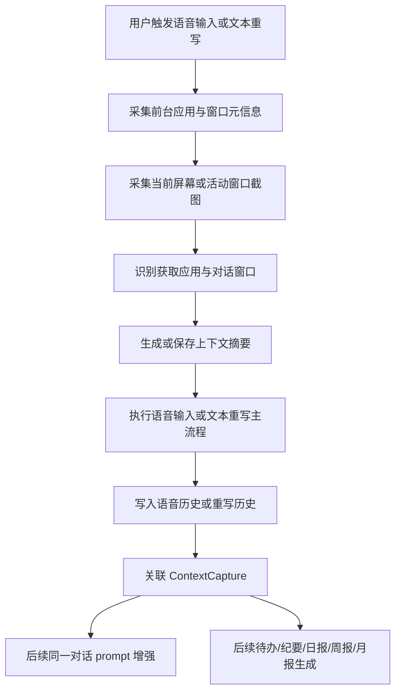

# 语音输入与文本重写上下文采集需求文档

状态：Draft  
日期：2026-06-25  
适用范围：VoxHub / OpenLess 当前版本，主要应用目录 `openless-all/app/`  
需求类型：新增功能，有 UI 与系统能力  

## 1. 背景

VoxHub 当前已经具备语音输入、语音润色、文本插入、语音历史、文本重写与重写历史等能力。下一阶段需要在用户使用语音输入或文本重写时，自动采集当前屏幕与前台上下文，形成后续提示词优化和内容生成的数据基础。

本需求重点解决两个问题：

1. 在语音输入和文本重写发生时，记录用户当时正在面向哪个应用、哪个对话或编辑窗口。
2. 将这些上下文与语音历史、重写历史建立关联，供后续同一对话内的语音润色、文本重写、待办事项、纪要、日报、周报、月报生成使用。

## 2. 产品目标

- 当用户开启语音输入时，系统自动采集一次当前上下文。
- 当用户执行文本重写时，系统自动采集一次当前上下文。
- 新增并稳定识别两个业务字段：
  - 获取应用：用户当前正在输入、重写或对话的目标应用。
  - 对话窗口：用户当前所在的具体对话、频道、网页、文档、窗口或输入场景。
- 语音历史和重写历史均可关联上下文采集结果，但两类历史仍保持数据隔离。
- 后续语音润色和文本重写可以在同一对话内引用上下文，提升表达准确性和连贯性。
- 后续可基于语音历史、重写历史和上下文信息生成待办、纪要、日报、周报、月报。

## 3. 当前现状与差距

| 现有能力 | 当前范围 | 与本需求关系 | 差距 |
| --- | --- | --- | --- |
| 语音输入上下文 | 语音会话开始时已经捕获前台应用信息，并用于部分润色上下文 | 可作为“获取应用”的已有基础 | 语音历史中当前未稳定沉淀应用字段，也没有截图与“对话窗口”字段 |
| 文本重写 | 已支持选区读取、LLM 重写、替换选区、失败回退剪贴板、独立重写历史 | 是本需求的第二个触发场景 | 重写历史目前主要保存来源应用、原文、重写结果，缺少截图上下文与“对话窗口” |
| 对话感知润色 | 已可读取最近语音历史作为多轮润色上下文 | 可扩展为跨语音/重写的上下文引用 | 当前主要依赖历史文本与风格包边界，不具备应用/对话窗口维度 |
| 历史记录 | 语音历史与重写历史已经分离 | 满足本需求的数据隔离前提 | 需要新增共同的上下文引用层，而不是混写两类历史 |

## 4. 范围

### 4.1 本期范围

- 在语音输入开始时进行上下文采集。
- 在文本重写开始时进行上下文采集。
- 采集当前屏幕截图或活动窗口截图，用于识别上下文。
- 识别并保存“获取应用”和“对话窗口”两个字段。
- 将上下文采集结果关联到语音历史和重写历史。
- 在后续语音润色和文本重写提示词中，可按规则引入同一对话的上下文摘要。
- 在历史详情中展示本次记录关联的应用和对话窗口。
- 提供失败降级：截图失败或识别失败时，语音输入和文本重写主流程仍可继续。

### 4.2 非本期范围

- 不实现完整的待办、纪要、日报、周报、月报生成器。
- 不实现长期跨设备同步。
- 不做连续屏幕录制或后台持续截图。
- 不把语音历史和重写历史合并为同一个历史文件或同一个列表模型。
- 不要求首期识别所有应用的私有 DOM、聊天联系人或文档结构。
- 不要求首期保存原始截图作为长期历史资产。

## 5. 关键术语

| 术语 | 定义 | 示例 |
| --- | --- | --- |
| 上下文采集 | 在用户触发语音输入或文本重写时，采集当前目标应用、窗口、截图和可用文本线索的过程 | 开始语音输入时截取当前浏览器窗口 |
| 获取应用 | 用户当前正在操作的目标应用或前台应用 | 微信、企业微信、飞书、Chrome、Cursor、Word |
| 对话窗口 | 当前具体输入对象或工作上下文，不限于聊天窗口 | 微信联系人、飞书频道、浏览器标签页标题、文档标题、邮件主题、代码文件 |
| 上下文摘要 | 从应用、窗口、截图、OCR 或历史中提炼出的短文本，用于后续 prompt | “当前在企业微信群：项目周会，讨论上线风险” |
| 同一对话 | 应用和对话窗口相同或高度相似，并处于设定时间窗口内的连续记录集合 | 同一微信群内连续语音和重写 |

## 6. 用户故事

| ID | 用户故事 | 优先级 |
| --- | --- | --- |
| US-1 | 作为用户，我在聊天窗口开启语音输入时，希望系统知道我正在对哪个对话发言，从而让润色结果更贴合上下文 | P0 |
| US-2 | 作为用户，我选中文字执行重写时，希望系统知道这段文字所在的应用和对话窗口，从而更准确地改写语气和称谓 | P0 |
| US-3 | 作为用户，我希望截图采集失败时，不影响语音输入或重写主流程 | P0 |
| US-4 | 作为用户，我希望历史详情能显示这条记录来自哪个应用和对话窗口，方便回溯 | P1 |
| US-5 | 作为用户，我希望后续在同一对话内继续语音或重写时，系统能引用近期上下文，提高结果质量 | P1 |
| US-6 | 作为用户，我希望后续能基于语音历史和重写历史生成待办、纪要和周期报告 | P2 |
| US-7 | 作为隐私敏感用户，我希望能关闭截图上下文采集，并能清理已采集的上下文数据 | P0 |

## 7. 功能需求

### REQ-1 上下文采集触发

系统应在以下场景自动发起一次上下文采集：

- 用户开启语音输入时。
- 用户执行文本重写时。

采集动作必须尽量发生在 VoxHub 自身悬浮窗、胶囊或错误提示出现之前，避免截图中主要捕获到 VoxHub 自身 UI。

验收标准：

- [ ] 触发语音输入后，当前记录可关联一条上下文采集结果。
- [ ] 触发文本重写后，当前重写记录可关联一条上下文采集结果。
- [ ] 截图采集失败时，语音输入和文本重写仍能按原有流程继续。
- [ ] 采集过程不会明显增加用户可感知启动延迟。

### REQ-2 获取应用识别

系统应识别用户触发操作时的目标应用，并以“获取应用”字段保存。

字段含义：

- 用户可见名称：获取应用。
- 推荐代码概念：`contextApp`。
- 内容应优先使用用户可理解的应用名；如可获得进程名、包名、bundle id、窗口标题，可作为辅助信息。

识别要求：

- Windows 首期至少能识别前台窗口标题，并尽量归一化出应用名称。
- macOS 首期至少能识别前台应用名称和 bundle id。
- Linux 可作为 best-effort，无法识别时为空，但不得阻塞主流程。
- 对同一应用的不同窗口，应用名称应尽量稳定。

验收标准：

- [ ] 在常见 Windows 应用中触发语音输入，历史详情可看到“获取应用”。
- [ ] 在常见 Windows 应用中触发文本重写，重写历史详情可看到“获取应用”。
- [ ] 应用识别为空时，历史记录仍可正常保存。

### REQ-3 对话窗口识别

系统应识别用户当前所在的具体对话、频道、网页、文档、编辑器或窗口，并以“对话窗口”字段保存。

字段含义：

- 用户可见名称：对话窗口。
- 推荐代码概念：`conversationWindow`。
- 内容应尽量表示“这条输入属于哪个上下文”，而不只是应用名。

示例：

| 场景 | 获取应用 | 对话窗口 |
| --- | --- | --- |
| 微信聊天 | 微信 | 张三 / 产品群 |
| 企业微信 | 企业微信 | 研发周会群 |
| 飞书 | 飞书 | #项目上线 |
| 浏览器网页 | Chrome | ChatGPT - VoxHub 需求讨论 |
| 邮件客户端 | Outlook | Re: Q3 项目计划 |
| 编辑器 | Cursor | `docs/context-capture-for-voice-rewrite-prd.md` |

识别来源可包括窗口标题、截图 OCR、可访问性信息、浏览器标题、系统窗口元信息等。首期不要求所有来源都实现，但业务上必须保留置信度和空值能力。

验收标准：

- [ ] 在至少 3 类常见场景中可识别出非空“对话窗口”。
- [ ] 无法识别时，字段为空或显示“未识别”，主流程不失败。
- [ ] 同一对话窗口内连续语音和重写记录能被归入同一上下文组。

### REQ-4 截图采集与上下文摘要

系统应在触发时采集当前屏幕或活动窗口截图，并基于截图识别上下文线索。

产品要求：

- 截图用于提取上下文，不应默认长期保存原始图片。
- 首期可保存结构化识别结果和短摘要。
- 如需要保存原始截图用于调试，应受独立开关控制，并有清理入口。
- 截图内容可能包含隐私信息，必须提供关闭能力。

上下文摘要应尽量短，只保留对润色、重写和内容生成有帮助的信息，例如：

- 当前对话对象或频道。
- 当前讨论主题。
- 当前页面或文档标题。
- 与用户即将输入内容直接相关的可见上下文。

验收标准：

- [ ] 采集成功后可生成一段短上下文摘要或保存可用于生成摘要的结构化信息。
- [ ] 原始截图默认不作为长期历史展示内容。
- [ ] 用户关闭上下文采集后，不再触发截图。

### REQ-5 历史记录关联

语音历史和重写历史应继续保持独立，但每条记录都可以关联上下文采集结果。

要求：

- 语音历史新增上下文引用和展示字段。
- 重写历史新增上下文引用和展示字段。
- 清空语音历史不应自动清空重写历史。
- 清空重写历史不应自动清空语音历史。
- 上下文采集数据的清理策略应独立定义，并能处理孤儿上下文记录。

验收标准：

- [ ] 语音历史详情可展示获取应用、对话窗口和上下文摘要。
- [ ] 重写历史详情可展示获取应用、对话窗口和上下文摘要。
- [ ] 清空任一历史模块不会破坏另一历史模块。

### REQ-6 同一对话内 prompt 优化

系统应支持在后续语音润色和文本重写中引入同一对话的近期上下文。

引用规则：

- 优先引用同一“获取应用 + 对话窗口”的近期记录。
- 可同时引用语音历史和重写历史中的成功结果。
- 失败记录默认不进入 prompt 上下文。
- 上下文必须有数量和长度上限，避免 prompt 过长。
- 当用户切换应用或对话窗口后，应自动切换上下文边界。

验收标准：

- [ ] 同一对话内连续语音输入时，后续润色能接收近期上下文。
- [ ] 同一对话内先重写后语音，语音润色可引用最近重写结果。
- [ ] 切换到另一个对话窗口后，不再引用上一个对话窗口的上下文。
- [ ] 用户关闭上下文增强后，prompt 不再包含上下文摘要。

### REQ-7 内容生成数据基础

系统应为后续生成待办、纪要、日报、周报、月报提供可查询的数据基础。

本期只要求数据沉淀，不要求实现完整生成入口。

需要沉淀的业务信息：

- 记录类型：语音输入 / 文本重写。
- 发生时间。
- 获取应用。
- 对话窗口。
- 原始输入。
- 最终文本。
- 上下文摘要。
- 风格包或处理方式。
- 是否成功。

验收标准：

- [ ] 能按时间范围查询语音历史和重写历史。
- [ ] 能按获取应用和对话窗口筛选相关记录。
- [ ] 能区分原始输入与最终文本。
- [ ] 数据结构支持后续生成待办、纪要和周期报告，不需要迁移语音/重写历史到同一个文件。

### REQ-8 用户设置与隐私控制

用户应可以控制上下文采集能力。

设置项建议：

| 设置项 | 默认建议 | 说明 |
| --- | --- | --- |
| 上下文采集 | 开启 | 触发语音输入和重写时采集应用、窗口和截图上下文 |
| 截图识别 | 开启 | 用截图识别对话窗口和上下文摘要 |
| 保存原始截图 | 关闭 | 默认不长期保存原始截图 |
| 上下文增强 prompt | 开启 | 允许在同一对话内引用近期上下文 |
| 上下文保留天数 | 跟随历史或单独配置 | 控制上下文记录生命周期 |

验收标准：

- [ ] 用户关闭上下文采集后，不再截图，也不再写入新的上下文记录。
- [ ] 用户关闭上下文增强后，仍可保存历史，但 prompt 不引用上下文。
- [ ] 用户可以清理上下文数据。

## 8. 数据概念

本需求建议新增“上下文采集记录”作为语音历史和重写历史之外的共同引用层。

| 数据概念 | 说明 | 与现有历史关系 |
| --- | --- | --- |
| ContextCapture | 一次上下文采集结果 | 可被语音历史或重写历史引用 |
| ContextApp | 获取应用 | 可冗余展示在历史详情中 |
| ConversationWindow | 对话窗口 | 用于同一对话归组 |
| ContextSummary | 上下文摘要 | 用于 prompt 增强和后续内容生成 |
| ContextGroup | 同一对话的聚合视图 | 由应用、对话窗口和时间窗口推导 |

语音历史和重写历史不需要合并。未来内容生成能力可以在读取层聚合两类历史和上下文记录。

## 9. 核心流程



## 10. UI/UX 要求

### 10.1 主流程反馈

- 上下文采集不应新增打断式弹窗。
- 语音输入和文本重写仍沿用现有胶囊或悬浮反馈。
- 截图或识别失败时，不应覆盖原有语音/重写错误提示。
- 如需要提示，应使用轻量文案，例如“未识别当前对话，上下文增强已跳过”。

### 10.2 历史详情展示

语音历史和重写历史详情中建议新增：

```text
获取应用：企业微信
对话窗口：产品上线讨论群
上下文：当前对话正在讨论 6 月版本上线风险和测试安排
```

当无法识别时：

```text
获取应用：未识别
对话窗口：未识别
上下文：未采集
```

### 10.3 设置页

建议在设置页新增“上下文增强”区域，包含：

- 上下文采集开关。
- 截图识别开关。
- 上下文增强 prompt 开关。
- 保存原始截图开关。
- 清理上下文数据操作。

## 11. 错误与降级

| 场景 | 用户可见行为 | 数据行为 |
| --- | --- | --- |
| 截图权限缺失 | 主流程继续，必要时提示无法截图 | 记录 captureFailed |
| 应用识别失败 | 主流程继续 | 获取应用为空 |
| 对话窗口识别失败 | 主流程继续 | 对话窗口为空 |
| 上下文摘要失败 | 主流程继续 | 摘要为空，不进入 prompt |
| 用户关闭采集 | 不截图，不提示错误 | 不新增上下文记录 |
| prompt 上下文过长 | 自动截断 | 保留最近、最相关上下文 |

## 12. 非功能需求

| 类别 | 要求 |
| --- | --- |
| 性能 | 上下文采集不能明显拖慢语音输入启动和重写启动；无法快速完成时应异步或降级 |
| 隐私 | 默认不长期保存原始截图；提供关闭、清理、保留周期控制 |
| 兼容性 | Windows 优先；macOS 保留应用识别能力；Linux best-effort |
| 稳定性 | 采集失败不得影响语音输入、文本重写、插入、历史保存 |
| 可扩展性 | 数据结构应支持后续内容生成，不与语音历史或重写历史强耦合 |

## 13. 成功指标

| 指标 | 目标 | 数据来源 |
| --- | --- | --- |
| 上下文采集成功率 | 常见 Windows 应用中达到 90% 以上 | 本地统计事件 |
| 获取应用识别成功率 | 常见 Windows 应用中达到 95% 以上 | 历史记录字段非空率 |
| 对话窗口识别成功率 | 首期目标 60% 以上 | 历史记录字段非空率 |
| 主流程失败率影响 | 新能力上线后不增加语音/重写失败率 | 语音与重写错误码统计 |
| prompt 上下文命中率 | 同一对话连续使用时可命中近期上下文 | prompt 构建日志或调试统计 |

## 14. 分阶段路线图

### Phase 1：采集与字段沉淀

目标：完成语音输入和文本重写触发时的上下文采集，保存获取应用、对话窗口和上下文摘要。

范围：

- 新增上下文采集记录。
- 语音历史和重写历史关联上下文记录。
- 历史详情展示获取应用和对话窗口。
- 设置页提供上下文采集开关。

### Phase 2：同一对话 prompt 增强

目标：在后续语音润色和文本重写中引用同一对话的近期上下文。

范围：

- 建立同一对话归组规则。
- 语音润色引用同一对话上下文。
- 文本重写引用同一对话上下文。
- 提供 prompt 上下文长度上限和关闭开关。

### Phase 3：历史聚合与内容生成准备

目标：让语音历史和重写历史可被统一查询，用于生成待办、纪要和周期报告。

范围：

- 按应用、对话窗口、时间范围聚合历史。
- 生成内容前的数据预览。
- 定义待办、纪要、日报、周报、月报所需输入字段。

### Phase 4：内容生成入口

目标：正式提供待办、纪要、日报、周报、月报生成能力。

范围：

- 选择时间范围和上下文范围。
- 生成待办事项。
- 生成纪要。
- 生成日报、周报、月报。
- 结果可复制、重写、保存。

## 15. 验收清单

- [ ] 开启语音输入时自动采集上下文。
- [ ] 执行文本重写时自动采集上下文。
- [ ] 语音历史能展示获取应用和对话窗口。
- [ ] 重写历史能展示获取应用和对话窗口。
- [ ] 截图失败不影响语音输入和重写主流程。
- [ ] 用户可关闭上下文采集。
- [ ] 用户可关闭上下文 prompt 增强。
- [ ] 同一对话内后续语音或重写可以引用近期上下文。
- [ ] 切换对话窗口后不会串用旧对话上下文。
- [ ] 数据结构可支撑后续待办、纪要和周期报告生成。

## 16. 待确认问题

1. 原始截图是否允许在本地短期保存？建议默认不保存，仅保存识别结果和摘要。
2. “对话窗口”的首期识别优先级是否以聊天应用为主，还是浏览器、编辑器、文档类应用同等优先？
3. 上下文增强是否默认开启？建议默认开启，但提供明显关闭入口。
4. 同一对话的时间窗口是否沿用当前润色上下文窗口，还是为上下文采集单独配置？
5. 后续“撰写历史”是否仍指现有“重写历史”，还是计划扩展为包含手写、生成、改写等更大的创作记录模块？

## TRACEABILITY-METADATA

```yaml
schema:
  profile: prd-profile-v1
artifact:
  id: PRD-CONTEXT-CAPTURE-VOICE-REWRITE
  type: PRD
  title: 语音输入与文本重写上下文采集需求文档
  status: draft
  source_documents:
    - user:2026-06-25-context-capture-requirement
entities:
  requirements:
    - id: REQ-1
      class: functional
      title: 上下文采集触发
      statement: 系统应在语音输入开始和文本重写开始时自动发起上下文采集，且采集失败不得阻断主流程。
      priority: P0
      status: draft
      scope: voice,rewrite,context-capture
      acceptance_criteria:
        - 语音输入记录可关联上下文采集结果。
        - 文本重写记录可关联上下文采集结果。
        - 截图或识别失败时主流程继续。
    - id: REQ-2
      class: functional
      title: 获取应用识别
      statement: 系统应识别并保存用户触发操作时的目标应用。
      priority: P0
      status: draft
      scope: context-capture,history
      acceptance_criteria:
        - 语音历史可展示获取应用。
        - 重写历史可展示获取应用。
        - 无法识别时字段可为空且不影响主流程。
    - id: REQ-3
      class: functional
      title: 对话窗口识别
      statement: 系统应识别并保存当前具体对话、频道、网页、文档或编辑窗口。
      priority: P0
      status: draft
      scope: context-capture,history
      acceptance_criteria:
        - 常见场景可识别非空对话窗口。
        - 无法识别时可降级为空。
        - 同一对话窗口内记录可归组。
    - id: REQ-4
      class: functional
      title: 截图采集与上下文摘要
      statement: 系统应在触发时采集截图并提取上下文摘要，默认不长期保存原始截图。
      priority: P0
      status: draft
      scope: screenshot,context-summary,privacy
      acceptance_criteria:
        - 可生成上下文摘要或结构化识别结果。
        - 原始截图默认不长期保存。
        - 用户关闭采集后不再截图。
    - id: REQ-5
      class: functional
      title: 历史记录关联
      statement: 语音历史和重写历史应保持隔离，并分别关联上下文采集记录。
      priority: P0
      status: draft
      scope: voice-history,rewrite-history,context-capture
      acceptance_criteria:
        - 两类历史均可展示上下文字段。
        - 清空任一历史不影响另一历史。
        - 上下文记录可独立清理。
    - id: REQ-6
      class: functional
      title: 同一对话 prompt 优化
      statement: 系统应支持在同一应用和对话窗口内为后续语音润色和文本重写引用近期上下文。
      priority: P1
      status: draft
      scope: prompt,voice,rewrite
      acceptance_criteria:
        - 同一对话内后续请求可命中近期上下文。
        - 切换对话窗口后不串用上下文。
        - 用户关闭上下文增强后 prompt 不包含上下文。
    - id: REQ-7
      class: functional
      title: 内容生成数据基础
      statement: 系统应沉淀可按时间、应用、对话窗口查询的语音和重写记录，为后续待办、纪要和周期报告生成提供输入。
      priority: P2
      status: draft
      scope: reporting,history,context
      acceptance_criteria:
        - 可按时间范围查询记录。
        - 可按应用和对话窗口筛选记录。
        - 可区分原始输入和最终文本。
    - id: REQ-8
      class: non_functional
      title: 用户设置与隐私控制
      statement: 用户应可关闭上下文采集、截图识别和上下文 prompt 增强，并可清理上下文数据。
      priority: P0
      status: draft
      scope: privacy,settings
      acceptance_criteria:
        - 关闭采集后不再截图。
        - 关闭 prompt 增强后不引用上下文。
        - 用户可清理上下文数据。
relations:
  - type: derived_from
    from: REQ-1
    to: user:2026-06-25-context-capture-requirement
  - type: derived_from
    from: REQ-2
    to: user:2026-06-25-context-capture-requirement
  - type: derived_from
    from: REQ-3
    to: user:2026-06-25-context-capture-requirement
  - type: derived_from
    from: REQ-7
    to: user:2026-06-25-context-capture-requirement
```
