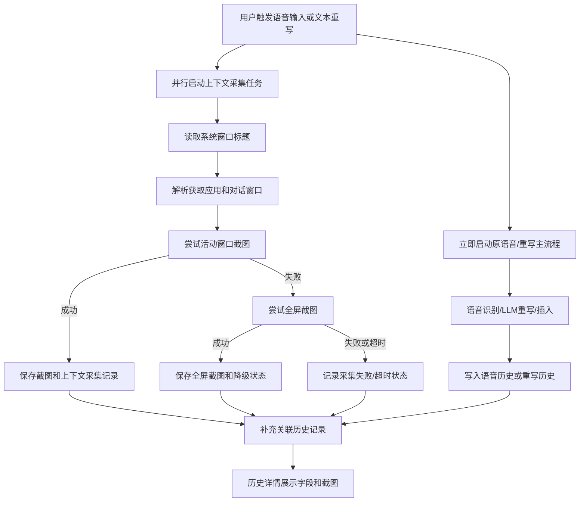

# 上下文采集专项规划文档

状态：Draft  
日期：2026-06-25  
适用范围：VoxHub / OpenLess 当前版本，主要应用目录 `openless-all/app/`  
当前阶段：专项规划与后续开发输入，不进入代码实现  

## 1. 背景与目标

VoxHub 当前已经具备语音输入、语音润色、文本插入、语音历史、文本重写和重写历史能力。下一步需要为语音输入和文本重写补充一层“上下文采集”数据基础：在用户开启语音输入或执行文本重写时，自动采集当前窗口上下文和截图，并把采集结果关联到对应历史记录。

本专项首期目标是：

- 用户开启语音输入时，自动采集当前上下文。
- 用户执行文本重写时，自动采集当前上下文。
- 识别并保存“获取应用”和“对话窗口”两个字段。
- 保存原始截图，并在语音历史详情和重写历史详情中展示，用于测试调试。
- 不把截图发送给 LLM，不把截图放入 prompt。
- 为后续同一对话内 prompt 优化、历史筛选、待办事项、纪要、日报、周报、月报生成提供数据基础。

## 2. 当前代码现状

当前分支：`qoder/text-rewrite`。  
最新相关提交：

- `40832a6b feat: add text rewrite feature (Phase 1-4)`
- `978a97ed feat: Phase 5 风格包用途分离与市场复用`

也就是说，文本重写主功能和 Phase 5 风格包用途分离已经写入当前分支。本专项不再把“实现文本重写”作为待开发事项，只补充截图上下文采集、对话窗口识别和历史详情截图展示。

| 现有能力 | 当前状态 | 与本专项关系 | 来源 |
| --- | --- | --- | --- |
| 文本重写主流程 | 已实现选区读取、LLM 重写、恢复焦点、替换选区、失败回退剪贴板、状态事件和 capsule 反馈 | 上下文采集必须在不破坏现有重写链路的前提下接入 | `openless-all/app/src-tauri/src/coordinator/rewrite_flow.rs` |
| 重写历史 | 已有独立 `RewriteHistoryEntry` 和 `rewrite-history.json`，包含原文、重写结果、风格包、来源应用、插入状态、错误码、耗时 | 仍缺少截图、对话窗口、采集状态和上下文引用 | `openless-all/app/src-tauri/src/types.rs`、`openless-all/app/src-tauri/src/persistence/rewrite_history.rs` |
| 重写历史 UI | 历史页已支持“语音历史 / 重写历史”分段，重写详情已展示原文、重写结果、来源应用、风格包、插入状态等 | 需要在重写详情中补充上下文字段和截图预览；列表仍不展示截图缩略图 | `openless-all/app/src/pages/History.tsx` |
| 重写快捷键与设置 | 已有 `rewrite_hotkey`、`rewrite_save_history`、`active_rewrite_style_pack_id` 等偏好项 | 上下文采集开关应作为独立偏好项，不复用重写历史开关 | `openless-all/app/src-tauri/src/types.rs`、`openless-all/app/src-tauri/src/commands/hotkeys.rs` |
| 风格包用途分离 | 已有 `StylePackScope::Voice / Rewrite`、重写内置风格包、重写激活风格包和风格市场复用相关能力 | 本专项不再改风格包体系，只确保后续 prompt 增强不串改语音/重写风格选择 | `openless-all/app/src-tauri/src/types.rs`、`openless-all/app/src-tauri/src/persistence/style_pack.rs` |
| 语音输入前台应用捕获 | 语音会话开始时已有 `front_app` 捕获，并传入润色、翻译、流式润色路径 | 可作为“获取应用 / 对话窗口”的首期输入基础 | `openless-all/app/src-tauri/src/coordinator/dictation.rs`、`openless-all/app/src-tauri/src/coordinator_state.rs` |
| 语音历史 | `DictationSession` 已有 `app_name` 字段，但当前主要写入路径仍为 `None`，历史详情未展示截图 | 需要补齐语音历史的上下文关联、应用/对话展示和截图展示 | `openless-all/app/src-tauri/src/types.rs`、`openless-all/app/src-tauri/src/coordinator/dictation.rs` |
| 历史隔离 | 语音历史与重写历史已经分离，重写历史不写入 `history.json` | 本专项继续保持隔离，只新增共同上下文引用层 | `openless-all/app/src-tauri/src/persistence/history.rs`、`openless-all/app/src-tauri/src/persistence/rewrite_history.rs` |
| 截图上下文采集 | 当前分支未发现语音/重写触发时的活动窗口截图、全屏回退截图、截图保存、截图历史详情展示能力 | 这是本专项首期新增的核心能力 | 当前分支搜索 `screenshot` / `截图` 未发现对应业务实现 |

## 3. 已确认产品决策

| 决策项 | 已确认方案 |
| --- | --- |
| 截图触发时机 | 开启语音输入时、执行文本重写时 |
| 截图范围 | 优先活动窗口截图，失败后回退全屏截图 |
| 截图外发 | 不允许发送给 LLM 服务 |
| 截图用途 | 本地保存，历史详情展示，用于测试调试 |
| 历史列表 | 不展示截图缩略图 |
| 历史详情 | 语音历史详情和重写历史详情展示截图 |
| 保留周期 | 默认跟随现有历史保留周期 |
| 字段识别来源 | 首期基于系统窗口标题 |
| 采集默认状态 | 默认开启 |
| 历史命名 | 继续使用“语音历史”和“重写历史” |

## 4. 首期范围

### 4.1 本期做

- 在语音输入开始时采集上下文。
- 在文本重写开始时采集上下文。
- 读取系统窗口标题，识别“获取应用”和“对话窗口”。
- 优先保存活动窗口截图，失败后保存全屏截图。
- 将上下文采集结果关联到语音历史或重写历史。
- 在语音历史详情展示截图和上下文字段。
- 在重写历史详情展示截图和上下文字段。
- 上下文采集作为旁路任务并行执行，不阻塞语音识别、文本重写、插入或历史写入。
- 上下文采集失败、超时或卡住时，语音输入和重写主流程继续。
- 提供上下文采集开关，默认开启。

### 4.2 本期不做

- 不做 OCR。
- 不做视觉 LLM 识别。
- 不把截图发送给 LLM。
- 不把截图内容放入 prompt。
- 不做主题识别。
- 不做历史记录按窗口、对话或主题筛选。
- 不做待办事项、纪要、日报、周报、月报生成入口。
- 不合并语音历史和重写历史。
- 不改变现有语音输入、重写插入、剪贴板回退、风格包和 ASR 主链路。

## 5. 字段定义

| 字段 | 用户可见名称 | 首期含义 | 空值策略 |
| --- | --- | --- | --- |
| `contextApp` | 获取应用 | 从系统窗口标题中解析或归一化出的应用名称 | 无法识别时为空，历史详情显示“未识别” |
| `conversationWindow` | 对话窗口 | 从系统窗口标题中解析出的具体窗口、会话、频道、网页、文档或编辑上下文 | 无法识别时为空，历史详情显示“未识别” |
| `windowTitle` | 窗口标题 | 触发时读取到的原始系统窗口标题 | 读取失败时为空 |
| `screenshotPath` | 截图 | 本地保存的截图文件路径或引用 | 截图失败时为空 |
| `captureStatus` | 采集状态 | `success`、`activeWindowFailedFullScreenSuccess`、`failed` | 必须有值 |
| `captureSource` | 截图来源 | `activeWindow` 或 `fullScreen` | 截图失败时为空 |
| `capturedAt` | 采集时间 | 上下文采集发生时间 | 必须有值 |
| `linkedHistoryType` | 关联历史类型 | `voice` 或 `rewrite` | 主流程未产生历史时可为空 |
| `linkedHistoryId` | 关联历史 ID | 对应语音历史或重写历史记录 ID | 主流程未产生历史时可为空 |

说明：

- 首期可以冗余保存“获取应用”和“对话窗口”到历史详情展示层，但语音历史和重写历史仍不合并。
- 上下文采集记录应作为共同引用层，服务语音历史和重写历史。
- “对话窗口”首期不承诺准确识别联系人、群名或频道名；如果系统窗口标题无法表达具体对话，则保留完整窗口标题或显示未识别。

## 6. 采集流程



关键规则：

- 上下文采集必须是旁路并行任务，主流程不得等待活动窗口截图、全屏截图、截图保存或上下文记录写入完成。
- 触发时可以同步读取极少量、低成本的窗口标识信息，但不得因为截图或文件 IO 阻塞语音识别启动、文本重写启动或插入链路。
- 上下文采集应尽量在 VoxHub 自身胶囊、悬浮窗或错误提示展示之前发起，避免截图主体变成 VoxHub UI；如果并行调度导致截图晚于 UI 展示，只记录实际采集结果，不回滚主流程。
- 截图失败、超时或保存失败不能中断语音输入、文本重写、插入、剪贴板回退或历史保存。
- 上下文采集任务必须有超时上限；超时后记录 `captureStatus=failed` 或等价失败状态，任务不得无限等待。
- 重写场景中，截图采集失败不能改变既有“优先替换选区，失败回退剪贴板”的策略。
- 如果上下文采集结果早于历史记录生成，可先保存为待关联状态，待主流程写入历史后再补充关联。
- 如果上下文采集结果晚于历史记录生成，可异步回填历史关联和详情展示字段。
- 如果主流程最终没有产生历史记录，上下文记录可以保留为未关联状态，后续清理时按保留周期处理。

## 7. 历史详情展示

### 7.1 语音历史

语音历史列表：

- 不展示截图缩略图。
- 可显示“有上下文 / 无上下文”或“有截图 / 无截图”状态，但不是首期必须项。

语音历史详情：

- 展示“获取应用”。
- 展示“对话窗口”。
- 展示“采集状态”。
- 展示截图预览。
- 截图支持点击查看大图，便于测试调试。
- 截图文件缺失或读取失败时，展示“截图不可用”，不影响原始转写、润色结果和录音播放等已有信息。

### 7.2 重写历史

重写历史列表：

- 不展示截图缩略图。
- 保持现有原文、重写结果、风格、插入状态等核心信息。

重写历史详情：

- 展示“获取应用”。
- 展示“对话窗口”。
- 展示“采集状态”。
- 展示截图预览。
- 截图支持点击查看大图，便于测试调试。
- 截图不可用时，不影响原文、重写结果、复制、删除等已有操作。

## 8. 存储与隐私

| 项目 | 首期规则 |
| --- | --- |
| 截图保存位置 | 本地应用数据目录下的上下文截图目录，具体路径由 HLD 决定 |
| 截图保留周期 | 默认跟随现有历史保留周期 |
| 截图外发 | 禁止发送给 LLM 或第三方服务 |
| prompt 使用 | 首期不进入语音润色或重写 prompt |
| 默认开关 | 上下文采集默认开启 |
| 关闭后行为 | 不读取窗口标题、不截图、不新增上下文采集记录 |
| 清理策略 | 历史保留周期清理时同步清理过期上下文记录和截图文件 |

隐私边界：

- 截图可能包含聊天内容、网页内容、文档内容或敏感信息，因此必须只在本地保存。
- 截图展示只出现在历史详情，不在历史列表中平铺展示。
- 后续如果需要把截图用于 OCR、视觉识别或 LLM，总是作为新需求单独确认，不默认继承首期能力。

## 9. 失败降级

| 失败点 | 处理方式 | 用户影响 |
| --- | --- | --- |
| 窗口标题读取失败 | `contextApp`、`conversationWindow` 为空，继续截图和主流程 | 历史详情显示未识别 |
| 活动窗口截图失败 | 自动尝试全屏截图 | 用户无感知或仅记录降级状态 |
| 全屏截图失败 | 记录 `captureStatus=failed`，主流程继续 | 历史详情显示无截图 |
| 截图任务超时 | 记录超时或失败状态，主流程继续 | 历史详情显示无截图或截图不可用 |
| 截图保存失败 | 记录失败状态，主流程继续 | 历史详情显示截图不可用 |
| 上下文记录保存失败 | 不阻断语音或重写历史保存 | 该条历史无上下文 |
| 历史详情读取截图失败 | 展示“截图不可用” | 不影响历史文本查看 |

## 10. 后续需求池

以下需求明确记录，但不进入首期实现：

| 后续需求 | 说明 | 建议阶段 |
| --- | --- | --- |
| 按窗口 + 对话筛选历史 | 历史记录可按“获取应用 + 对话窗口”分组、筛选、查看 | Phase 2 |
| 按主题筛选历史 | 基于文本、标签或摘要识别主题，按主题聚合历史 | Phase 3 |
| 同一对话 prompt 增强 | 后续语音润色和文本重写可引用同一对话内近期上下文 | Phase 2 |
| 跨语音和重写的上下文聚合 | 同一对话内同时读取语音历史和重写历史 | Phase 2 |
| 待办事项生成 | 基于历史记录提取行动项 | Phase 4 |
| 纪要生成 | 基于一个对话窗口或主题生成会议/讨论纪要 | Phase 4 |
| 日报、周报、月报生成 | 按时间范围聚合语音历史和重写历史生成周期报告 | Phase 4 |
| OCR / 视觉识别 | 从截图中识别更多上下文，但需要重新确认隐私和性能边界 | Phase 3+ |
| Windows Graphics Capture 截图方案评估 | 用于提升受合成层、特殊窗口影响时的截图覆盖率；当前 GDI 方案可满足首期调试展示，故列为最低优先级 | Phase 5 / P-low |

## 11. 分阶段路线

### Phase 1：上下文采集与历史详情展示

目标：

- 语音输入和文本重写触发时采集上下文。
- 保存窗口标题、获取应用、对话窗口、采集状态和截图。
- 语音历史详情和重写历史详情展示截图。
- 上下文采集与语音识别、文本重写主流程并行执行，不阻塞主流程。

验收：

- 在记事本、浏览器、企业微信等窗口触发语音输入，历史详情能看到上下文字段和截图。
- 在输入框中选中文字触发重写，重写历史详情能看到上下文字段和截图。
- 活动窗口截图失败时能回退全屏截图。
- 截图失败、保存失败或采集超时时，语音输入和重写仍正常完成。

### Phase 2：同一对话上下文引用与筛选

目标：

- 历史支持按“窗口 + 对话”筛选查看。
- 同一对话内的后续语音和重写可以引用近期上下文。

验收：

- 同一对话窗口内连续语音或重写可识别为同一上下文组。
- 切换窗口或对话后不会串用旧上下文。
- 用户可关闭 prompt 上下文增强。

### Phase 3：主题聚合与截图智能识别评估

目标：

- 评估按主题聚合历史的产品形态。
- 评估 OCR、视觉识别或本地解析对“对话窗口”识别质量的提升。

验收：

- 能按主题查看历史记录。
- 主题识别失败时可回退到窗口 + 对话筛选。
- 任何截图智能识别能力都需单独确认隐私边界。

### Phase 4：内容生成

目标：

- 基于语音历史、重写历史和上下文记录生成待办、纪要、日报、周报、月报。

验收：

- 用户可选择时间范围、窗口/对话范围或主题范围。
- 生成结果可复制、保存或继续重写。

## 12. 验收清单

### 语音输入场景

- [ ] 在记事本触发语音输入，语音历史详情展示获取应用、对话窗口和截图。
- [ ] 在浏览器触发语音输入，语音历史详情展示窗口标题解析结果和截图。
- [ ] 在企业微信触发语音输入，语音历史详情展示上下文字段和截图。
- [ ] 语音历史列表不展示截图缩略图。

### 重写场景

- [ ] 在输入框中选中文字触发重写，重写历史详情展示获取应用、对话窗口和截图。
- [ ] 重写替换成功时，截图采集不影响插入结果。
- [ ] 重写插入失败回退剪贴板时，截图采集不影响剪贴板回退策略。
- [ ] 重写历史列表不展示截图缩略图。

### 降级场景

- [ ] 模拟活动窗口截图失败，确认回退全屏截图。
- [ ] 模拟活动窗口和全屏截图都失败，确认主流程继续。
- [ ] 模拟截图任务卡住或超时，确认语音识别、重写、插入和历史写入不等待截图完成。
- [ ] 模拟窗口标题读取失败，确认历史详情显示未识别。
- [ ] 删除截图文件后打开历史详情，页面不崩溃并显示截图不可用。

### 隐私与存储

- [ ] 默认上下文采集开启。
- [ ] 关闭上下文采集后，不再读取窗口标题、不再截图、不再新增上下文记录。
- [ ] 截图不发送给 LLM。
- [ ] 截图不进入 prompt。
- [ ] 历史保留周期清理时，过期截图随上下文记录清理。

## 13. 不变项

- 不改变语音输入主链路。
- 不改变文本重写主链路。
- 不改变重写失败后的剪贴板回退策略。
- 不合并语音历史和重写历史。
- 不改变语音风格和重写风格体系。
- 不修改 ASR provider、录音、模型下载、本地 ASR 链路。

## TRACEABILITY-METADATA

```yaml
schema:
  profile: prd-profile-v1
artifact:
  id: PRD-CONTEXT-CAPTURE-SPECIAL-PLAN
  type: PRD
  title: 上下文采集专项规划文档
  status: draft
  source_documents:
    - user:2026-06-25-context-capture-special-plan
entities:
  requirements:
    - id: REQ-1
      class: functional
      title: 语音输入触发上下文采集
      statement: 用户开启语音输入时，系统应自动采集窗口标题、获取应用、对话窗口和截图，并关联到语音历史。
      priority: P0
      status: draft
      scope: voice,context-capture,history
      acceptance_criteria:
        - 语音历史详情展示获取应用、对话窗口和截图。
        - 截图采集失败不阻断语音输入。
    - id: REQ-2
      class: functional
      title: 文本重写触发上下文采集
      statement: 用户执行文本重写时，系统应自动采集窗口标题、获取应用、对话窗口和截图，并关联到重写历史。
      priority: P0
      status: draft
      scope: rewrite,context-capture,history
      acceptance_criteria:
        - 重写历史详情展示获取应用、对话窗口和截图。
        - 截图采集失败不影响重写替换和剪贴板回退。
    - id: REQ-3
      class: functional
      title: 活动窗口优先截图
      statement: 系统应以旁路并行任务优先截取活动窗口，活动窗口截图失败后回退全屏截图，且截图任务不得阻塞主流程。
      priority: P0
      status: draft
      scope: screenshot
      acceptance_criteria:
        - 活动窗口截图成功时保存活动窗口截图。
        - 活动窗口截图失败且全屏截图成功时保存全屏截图和降级状态。
        - 两种截图均失败时记录失败状态且主流程继续。
        - 截图任务超时时记录失败或超时状态，语音识别、文本重写、插入和历史写入不等待截图完成。
    - id: REQ-4
      class: functional
      title: 历史详情展示截图
      statement: 语音历史和重写历史详情页应展示截图，历史列表不展示截图缩略图。
      priority: P0
      status: draft
      scope: history,ui
      acceptance_criteria:
        - 语音历史详情可查看截图。
        - 重写历史详情可查看截图。
        - 历史列表不展示截图缩略图。
        - 截图文件缺失时详情页显示截图不可用。
    - id: REQ-5
      class: non_functional
      title: 截图隐私边界
      statement: 截图仅本地保存和详情展示，不发送给 LLM，不进入 prompt。
      priority: P0
      status: draft
      scope: privacy,storage
      acceptance_criteria:
        - 截图不发送给 LLM 或第三方服务。
        - 截图不进入语音润色或重写 prompt。
        - 关闭上下文采集后不再截图。
    - id: REQ-6
      class: functional
      title: 后续历史筛选能力记录
      statement: 后续应支持按窗口加对话筛选历史，并评估按主题筛选历史，但不进入首期实现。
      priority: P2
      status: draft
      scope: history,filtering,future
      acceptance_criteria:
        - 专项规划中明确记录按窗口加对话筛选历史为后续需求。
        - 专项规划中明确记录按主题筛选历史为后续需求。
relations:
  - type: derived_from
    from: REQ-1
    to: user:2026-06-25-context-capture-special-plan
  - type: derived_from
    from: REQ-2
    to: user:2026-06-25-context-capture-special-plan
  - type: derived_from
    from: REQ-3
    to: user:2026-06-25-context-capture-special-plan
  - type: derived_from
    from: REQ-4
    to: user:2026-06-25-context-capture-special-plan
  - type: derived_from
    from: REQ-5
    to: user:2026-06-25-context-capture-special-plan
  - type: derived_from
    from: REQ-6
    to: user:2026-06-25-context-capture-special-plan
```
