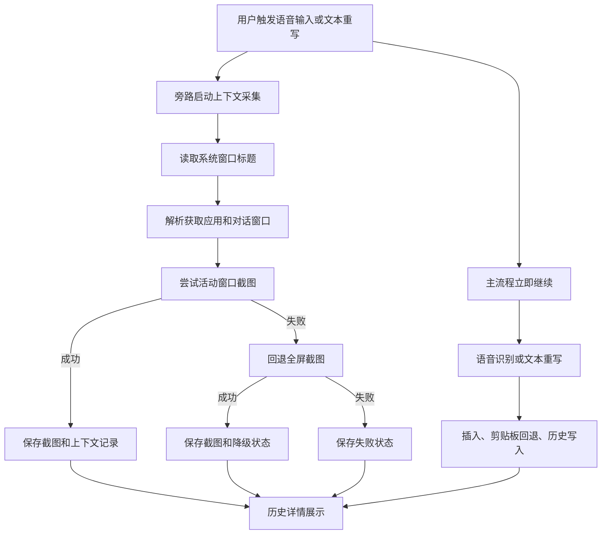

# 上下文采集目标模式文档

状态：Phase 1 implemented  
日期：2026-06-25  
分支：`codex/context-capture`，基于 `qoder/text-rewrite`  
上游依据：`docs/context-capture-special-plan.md`

## 1. 目标

Phase 1 的目标是在不改变现有语音输入、文本重写、插入和历史隔离策略的前提下，新增“上下文采集”旁路能力：

- 用户开启语音输入时，自动采集当前窗口上下文。
- 用户执行文本重写时，自动采集当前窗口上下文。
- Windows 首期优先截取活动窗口，失败后回退全屏截图。
- 上下文采集结果关联到语音历史或重写历史。
- 语音历史详情和重写历史详情展示获取应用、对话窗口、采集状态和截图预览。
- 历史列表不展示截图缩略图。
- 截图只保存在本地，不发送给 LLM，不进入语音润色或文本重写 prompt。

## 2. 范围

### 本期做

- 新增上下文采集记录类型和独立持久化文件。
- 新增本地截图目录。
- 新增偏好项 `contextCaptureEnabled`，默认开启。
- Windows 实现窗口标题读取、活动窗口截图、全屏截图回退。
- macOS / Linux / Android 安全降级，不阻断主流程。
- 在语音输入开始和文本重写开始时启动旁路采集任务。
- 旁路采集设置 5 秒超时兜底；超时写入失败状态，不等待截图完成。
- 通过历史 ID 将上下文记录关联到语音历史或重写历史。
- 历史详情页展示上下文字段和截图预览。
- 提供安全 IPC 读取截图字节，前端不直接读取本地绝对路径。

### 本期不做

- 不做 OCR。
- 不做视觉 LLM 识别。
- 不把截图发送给 LLM。
- 不把截图或截图内容放入 prompt。
- 不做历史按窗口、对话或主题筛选。
- 不做待办、纪要、日报、周报、月报生成。
- 不合并 `history.json` 和 `rewrite-history.json`。
- 不修改 ASR provider、本地模型、下载器、风格包体系。
- 不修改文本重写的替换、插入和剪贴板回退策略。

## 3. 成功标准

- 在 Windows 的记事本、浏览器、企业微信等窗口触发语音输入后，语音历史详情能看到上下文字段和截图。
- 在 Windows 输入框中选中文字触发文本重写后，重写历史详情能看到上下文字段和截图。
- 活动窗口截图失败时，自动回退全屏截图，并记录降级状态。
- 截图完全失败、保存失败或采集任务异常时，语音输入、文本重写、插入、剪贴板回退和历史写入继续执行。
- 上下文记录读取失败时，历史列表仍正常返回，只是不附加上下文字段。
- 关闭上下文采集开关后，不读取窗口标题、不截图、不新增上下文记录。
- 截图文件缺失时，历史详情展示“截图不可用”，页面不崩溃。
- 旧的语音历史和重写历史缺少上下文字段时仍可正常读取。

## 4. 数据模型

新增上下文采集记录 `ContextCaptureEntry`：

- `id`：上下文记录 ID。
- `createdAt`：采集记录创建时间。
- `contextApp`：获取应用，首期从系统窗口标题解析或归一化。
- `conversationWindow`：对话窗口，首期从系统窗口标题解析具体窗口、会话、频道、网页、文档或编辑上下文。
- `windowTitle`：原始系统窗口标题。
- `captureStatus`：采集状态，包含成功、活动窗口失败后全屏成功、失败、平台不支持。
- `captureSource`：截图来源，活动窗口或全屏。
- `screenshotPath`：本地截图文件路径，仅后端使用，不暴露给前端。
- `linkedHistoryType`：关联历史类型，`voice` 或 `rewrite`。
- `linkedHistoryId`：关联语音历史或重写历史 ID。
- `errorCode`：失败原因。

语音历史和重写历史继续保持独立。上下文采集记录作为共同引用数据，在 IPC 返回历史列表时按 `linkedHistoryType + linkedHistoryId` 附加到历史条目，不迁移、不合并原历史文件。

## 5. 执行路径

关键约束：

- 上下文采集不 await，不阻塞主流程。
- 上下文采集最多等待 5 秒写入结果；超时按失败记录处理。
- 截图失败只写状态，不改变用户输入或重写结果。
- 截图记录使用预先确定的历史 ID 关联，避免异步回填原历史文件。
- 非 Windows 平台本期记录为不可用或跳过，不抛出阻断性错误。

## 6. 任务拆分

1. 类型与偏好
   - 增加 `ContextCaptureEntry`、采集状态、截图来源、历史类型。
   - 给 `DictationSession` 和 `RewriteHistoryEntry` 增加可选 `contextCapture` 字段。
   - 增加 `contextCaptureEnabled` 偏好项，默认 `true`。

2. 存储
   - 新增 `ContextCaptureStore`。
   - 记录写入 `context-capture.json`。
   - 截图保存到 `context-screenshots/`。
   - 清理策略跟随 `historyRetentionDays` 和历史条数上限。

3. Windows 采集
   - 读取前台窗口标题。
   - 从标题解析获取应用和对话窗口。
   - 优先截取活动窗口。
   - 活动窗口失败后回退全屏截图。
   - 截图保存为本地图片文件。

4. 触发与关联
   - 语音输入开始时，用当前 session ID 启动上下文采集。
   - 文本重写开始时，预生成重写历史 ID 并启动上下文采集。
   - 所有重写历史写入路径使用同一个预生成 ID。

5. IPC 与 UI
   - `list_history` 和 `list_rewrite_history` 返回附加上下文后的记录。
   - 新增 `read_context_screenshot`，按上下文 ID 读取截图字节。
   - 历史详情页展示上下文字段和截图预览。
   - 调试设置区新增上下文采集开关。

6. 验证
   - Rust：`cargo check`，必要单元测试。
   - 前端：TypeScript 检查或构建。
   - 手工：验证语音、重写、降级、关闭开关、截图缺失。

## 7. 风险与处理

- 截图 API 可能受系统权限、窗口类型、最小化窗口或安全窗口影响。处理方式：记录失败状态，主流程继续。
- 截图可能包含敏感信息。处理方式：默认仅本地保存，仅详情展示，不进入 LLM，不暴露文件路径。
- 异步采集可能晚于历史列表刷新。处理方式：用户刷新历史后可看到最新上下文；不为了等待截图阻塞主流程。
- BMP 文件体积可能大于压缩图片。处理方式：首期为减少依赖和实现风险采用 BMP；保留后续改为 PNG/JPEG 的空间。
- 更完整的 Windows 截图方案可后续评估 Windows Graphics Capture。处理方式：当前 GDI 截图方案继续作为首期实现；Windows Graphics Capture 仅进入后续迭代池，优先级最低。

## 8. 验收清单

- [ ] `contextCaptureEnabled` 默认开启。
- [ ] 关闭 `contextCaptureEnabled` 后不新增上下文记录和截图。
- [ ] 语音历史详情展示获取应用、对话窗口、采集状态、截图。
- [ ] 重写历史详情展示获取应用、对话窗口、采集状态、截图。
- [ ] 语音历史列表不展示截图缩略图。
- [ ] 重写历史列表不展示截图缩略图。
- [ ] 截图缺失时详情页显示“截图不可用”。
- [ ] 截图采集失败不影响语音输入。
- [ ] 截图采集失败不影响文本重写、插入和剪贴板回退。
- [ ] 截图不进入 LLM prompt。
