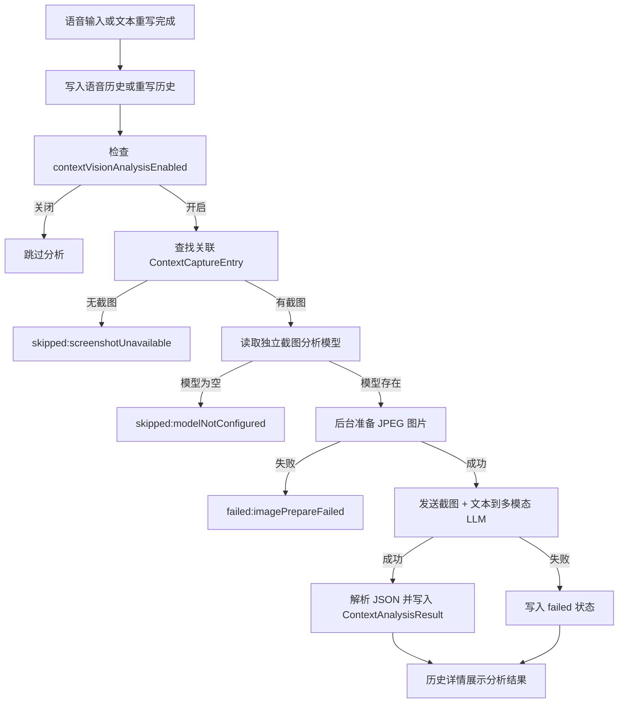

# 截图多模态上下文分析目标模式文档

状态：ready for target mode  
日期：2026-06-26  
目标分支：`codex/context-capture`  
上游依据：

- `docs/context-capture-special-plan.md`
- `docs/context-capture-target-mode.md`
- 用户确认的产品决策：截图 + 原文 -> 多模态 LLM；不做 OCR；V1 不注入润色/重写 prompt；V1 不做日报/周报/月报生成。

## 0. 目标模式执行契约

这份文档必须能直接交给目标模式执行，不需要再额外拆解或二次规划。目标模式执行时遵守以下契约：

- 以本文件作为 V1 实现依据，直接按第 13 节任务和第 18 节顺序实施。
- 如果当前代码与本文档描述不一致，先读取当前代码并做最小适配；只有遇到会改变产品边界或隐私边界的问题时再向用户确认。
- 不实现 OCR，不实现日报/周报/月报，不把分析结果注入语音润色或文本重写 prompt。
- 不调整 ASR、本地模型、风格包、插入、剪贴板回退、语音历史和重写历史的既有主流程。
- 所有截图上传前必须按第 7 节转换和压缩；禁止把原始 BMP 或原始 BMP 的 base64 发送给 LLM。
- 所有分析任务必须在后台执行，失败不得阻断语音输入、文本重写、插入、剪贴板回退和历史保存。

## 1. 目标

在现有上下文采集能力基础上，新增“截图多模态上下文分析”能力：

- 当用户开启语音输入或执行文本重写并产生历史记录后，系统可在用户授权后将本次截图与本次原始文本发送给支持图片输入的 LLM。
- LLM 结合截图上下文、原始录入文本，以及语音润色/文本重写后的结果，生成结构化分析结果。
- 分析结果包含对话名称、简要摘要、完整摘要、主题、用户意图、决策、待办、相关人员等字段。
- 简要摘要用于后续 prompt 上下文；完整摘要用于后续日报、周报、月报等汇总能力的数据基础。
- V1 只做分析、入库、历史详情展示、单条重试，不把分析结果注入语音润色或文本重写 prompt，不实现日报/周报/月报生成。

## 2. 当前代码现状

| 能力 | 当前现状 | 与本需求关系 | 主要文件 |
| --- | --- | --- | --- |
| 上下文采集 | 已有 `ContextCaptureEntry`，语音/重写触发时采集窗口标题和截图，截图保存在本地 | 本需求复用截图和历史关联，不重新实现截图采集 | `openless-all/app/src-tauri/src/context_capture.rs`、`openless-all/app/src-tauri/src/persistence/context_capture.rs` |
| 历史隔离 | 语音历史和重写历史独立，IPC 返回时按上下文记录 enrich | 本需求必须继续保持语音历史、重写历史、分析结果相互独立 | `commands/history.rs`、`commands/rewrite.rs`、`persistence/context_capture.rs` |
| 历史详情 UI | 已展示上下文字段和截图预览，截图支持缓存和点击预览 | 本需求在截图区域下方新增 AI 上下文分析区域 | `openless-all/app/src/pages/History.tsx` |
| LLM 凭据 | LLM API Key 和 Base URL 通过 active LLM provider 复用 `ark.api_key`、`ark.endpoint` | 本需求复用 API Key 和 Base URL；新增独立截图分析模型字段 | `persistence/credentials.rs`、`commands/providers.rs`、`pages/settings/ProvidersSection.tsx` |
| 模型拉取 | 设置页已有 `ProviderTools`，可校验连接、拉取模型、选择模型 | 本需求复用模型拉取选择交互，但模型字段独立 | `pages/settings/ProvidersSection.tsx` |
| 偏好设置 | 已有 `contextCaptureEnabled`，默认开启 | 本需求新增独立 `contextVisionAnalysisEnabled`，默认关闭 | `types.rs`、`src/lib/types.ts`、`DebugToolsSection.tsx` 或新增设置区 |

## 3. 产品决策

- 截图分析独立于上下文采集。上下文采集可以开启但截图分析关闭。
- 截图分析开关默认关闭。
- 只有开启截图分析后，才显示并允许配置多模态 LLM 模型。
- 首次开启截图分析时必须有授权提示，明确说明“截图和本次输入文本会发送给当前配置的 LLM 服务”。
- API Key 和 Base URL 复用现有 active LLM provider 的配置，不新增独立 API Key。
- 多模态模型单独配置，不复用语音润色/文本重写模型。
- 模型选择复用现有“拉取模型后选择”的交互。
- 模型可为空；为空时不执行分析，状态为 `skipped:modelNotConfigured` 或不新增分析结果。
- 模型选择旁显示灰色提示文案：`请确认该模型支持图片输入`。
- V1 不做本地 OCR，不做云端 OCR。
- V1 不把分析结果注入语音润色 prompt。
- V1 不把分析结果注入文本重写 prompt。
- V1 不做日报、周报、月报生成。
- V1 必须对图片做转换和质量压缩，避免直接发送大体积 BMP。
- 默认不保存原始模型响应，不记录截图 base64，不在日志中写 API Key。

## 4. 范围

### 4.1 本期做

- 新增截图分析开关和授权提示。
- 新增独立的截图分析模型配置。
- 新增上下文分析结果数据结构和持久化文件。
- 新增图片准备流程：读取本地 BMP，转换为 JPEG，限制尺寸并压缩质量。
- 新增多模态 LLM 调用，输入为截图 + 原始文本 + 处理后文本 + 窗口元数据。
- 新增结构化 JSON 解析和校验。
- 在语音历史/重写历史写入后异步触发分析。
- 历史详情展示分析结果。
- 历史详情支持单条重新分析。
- 分析失败不影响语音输入、文本重写、插入、剪贴板回退、历史保存。
- 分析结果跟随对应历史清理。

### 4.2 本期不做

- 不做 OCR。
- 不做自动注入语音润色 prompt。
- 不做自动注入文本重写 prompt。
- 不做日报、周报、月报生成。
- 不做批量重跑历史分析。
- 不做模型多模态能力强校验。
- 不保存原始模型响应。
- 不合并 `history.json`、`rewrite-history.json`、`context-capture.json`。
- 不调整现有 ASR、本地模型、风格包、插入和剪贴板策略。

## 5. 数据模型

### 5.1 新增偏好字段

在 Rust `UserPreferences` 和前端 `UserPreferences` 中新增：

```ts
type UserPreferences = {
  contextCaptureEnabled: boolean;
  contextVisionAnalysisEnabled: boolean; // 默认 false
  contextVisionAnalysisConsentAccepted: boolean; // 默认 false
};
```

规则：

- `contextVisionAnalysisEnabled=false` 时，不读取截图分析模型，不触发分析。
- `contextVisionAnalysisEnabled=true` 且 `contextVisionAnalysisConsentAccepted=false` 时，前端必须先展示授权提示；用户确认后才能保存开启。
- 关闭开关不删除已有分析结果。

### 5.2 新增模型凭据字段

在凭据系统中新增独立账号：

```text
ark.context_vision_model_id
```

规则：

- API Key 继续读取 active LLM provider 的 `ark.api_key`。
- Base URL 继续读取 active LLM provider 的 `ark.endpoint`。
- 模型读取 `ark.context_vision_model_id`。
- 模型字段允许为空；为空不触发分析。
- `CredentialsSnapshot` 前端快照中新增 `arkContextVisionModelId?: string`。

### 5.3 上下文分析结果

新增 `ContextAnalysisResult`：

```ts
type ContextAnalysisStatus = 'pending' | 'success' | 'failed' | 'skipped';

type ContextAnalysisResult = {
  id: string;
  contextCaptureId: string;
  linkedHistoryType: 'voice' | 'rewrite';
  linkedHistoryId: string;

  status: ContextAnalysisStatus;
  createdAt: string;
  analyzedAt: string | null;

  providerId: string | null;
  model: string | null;
  promptVersion: string;
  schemaVersion: number;

  inputMode: 'screenshot_text';
  imageMimeType: 'image/jpeg' | null;
  imageWidth: number | null;
  imageHeight: number | null;
  imageBytes: number | null;

  conversationName: string | null;
  briefSummary: string | null;
  fullSummary: string | null;

  detectedApp: string | null;
  detectedContextType:
    | 'chat'
    | 'ai_chat'
    | 'document'
    | 'browser'
    | 'editor'
    | 'email'
    | 'meeting'
    | 'task'
    | 'settings'
    | 'unknown';

  topic: string | null;
  userIntent: string | null;
  activityType:
    | 'decision'
    | 'action_request'
    | 'question'
    | 'discussion'
    | 'research'
    | 'planning'
    | 'implementation'
    | 'review'
    | 'note'
    | 'unknown';

  decision: string | null;
  actionItems: Array<{
    text: string;
    owner: string | null;
    dueDate: string | null;
    confidence: number;
  }>;

  relatedPeople: string[];
  projectOrDomain: string | null;
  visualEvidence: string[];

  sensitiveContentVisible: boolean;
  confidence: number;
  uncertaintyReason: string | null;

  errorCode: string | null;
};
```

持久化文件建议：

```text
%APPDATA%/OpenLess/context-analysis.json
```

关系：

- `ContextCaptureEntry` 保存截图采集事实。
- `ContextAnalysisResult` 保存 LLM 分析事实。
- 通过 `contextCaptureId` 和 `linkedHistoryType + linkedHistoryId` 关联。
- IPC 返回历史列表时可把最新分析结果附加到 `contextCapture.analysis` 或历史条目的 `contextAnalysis` 字段。目标模式执行时二选一即可，但必须保持语音历史和重写历史原始文件不合并。

## 6. 系统提示词

提示词版本：`context-vision-analysis-v1`

```text
你是 VoxHub 的“多模态上下文分析器”。

你的任务是根据用户提供的桌面截图、原始录入文本、处理后文本和窗口元数据，识别当前工作上下文，并输出可被程序稳定解析的 JSON。你的结果将用于后续语音润色、文本重写、历史归档、待办、日报、周报和月报生成。

你会收到以下输入：
- screenshot：当前窗口或全屏截图。
- rawInputText：本次语音输入原文，或本次文本重写前的原文。
- finalText：语音润色后的文本，语音场景可能存在。
- rewrittenText：文本重写后的文本，重写场景可能存在。
- historyType：voice 或 rewrite。
- windowTitle：系统读取到的窗口标题，可能为空或不准确。
- capturedApp：系统初步识别的应用名称，可能为空或不准确。
- capturedConversationWindow：系统初步识别的窗口、会话、频道、网页或文档名称，可能为空或不准确。

分析规则：
1. 必须同时参考截图和 rawInputText。finalText 或 rewrittenText 只能作为辅助理解，不得替代 rawInputText。
2. 优先从截图中识别具体上下文，例如聊天标题、联系人、群名、频道名、网页标题、文档名、编辑器项目、表单页面或任务页面。
3. 如果截图信息不足，再参考 windowTitle、capturedApp 和 capturedConversationWindow。
4. 不要把截图当作完整 OCR 任务。只提取对“当前上下文识别、摘要和后续归档”必要的少量文本线索。
5. 不要完整复述聊天记录、文档正文、账号、手机号、邮箱、地址、密钥、验证码、订单号等敏感内容。
6. 如果截图包含敏感信息，只做泛化描述，例如“界面中包含账号或身份信息”，不要输出原文。
7. 如果无法可靠判断，不要编造。请降低 confidence，并在 uncertaintyReason 中说明原因。
8. 如果截图和窗口标题冲突，优先相信截图中更具体、更可见的信息；但需要在 visualEvidence 中简短说明依据。
9. 输出语言使用简体中文。
10. 只输出一个合法 JSON 对象，不要输出 Markdown，不要添加解释性前后缀，不要输出推理过程。

摘要要求：
- briefSummary：用于后续提示词上下文。必须短、具体、低干扰，建议 30 到 80 个中文字符。说明“用户正在什么上下文中表达什么意图或确认什么事项”。
- fullSummary：用于日报、周报、月报和历史回顾。应比 briefSummary 更完整，建议 100 到 300 个中文字符。说明背景、参与对象、讨论主题、用户本次输入的含义、已形成的结论或后续价值。
- briefSummary 不要包含太多细节。
- fullSummary 可以包含必要细节，但不要复述大段截图文本或泄露敏感信息。

JSON 输出格式：
{
  "conversationName": "string | null",
  "briefSummary": "string",
  "fullSummary": "string",
  "detectedApp": "string | null",
  "detectedContextType": "chat | ai_chat | document | browser | editor | email | meeting | task | settings | unknown",
  "topic": "string | null",
  "userIntent": "string | null",
  "activityType": "decision | action_request | question | discussion | research | planning | implementation | review | note | unknown",
  "decision": "string | null",
  "actionItems": [
    {
      "text": "string",
      "owner": "string | null",
      "dueDate": "string | null",
      "confidence": 0.0
    }
  ],
  "relatedPeople": ["string"],
  "projectOrDomain": "string | null",
  "visualEvidence": ["string"],
  "sensitiveContentVisible": true,
  "confidence": 0.0,
  "uncertaintyReason": "string | null"
}

字段要求：
- conversationName：当前具体对话、频道、群、联系人、网页、文档、项目或页面名称。不要用“企业微信”“微信聊天窗口”这类泛称，除非无法识别具体名称。
- briefSummary：短摘要，用于后续 prompt 上下文。
- fullSummary：完整摘要，用于日报、周报、月报和历史回顾。
- detectedApp：截图中可判断的应用或网站名称。
- detectedContextType：只能从枚举中选择一个。
- topic：当前事件或对话主题，例如“小程序手机号绑定流程”。
- userIntent：根据 rawInputText 判断用户本次想表达、确认、重写或输入的意图。
- activityType：本次记录的行为类型。
- decision：如果本次记录形成了明确结论或确认事项，填写结论；否则为 null。
- actionItems：如果能明确提取待办事项，列出；否则为空数组。
- relatedPeople：截图中与本次上下文直接相关的人名、昵称或角色；无法识别则为空数组。
- projectOrDomain：所属项目、产品模块、业务域或技术域。
- visualEvidence：最多 3 条，只写用于判断上下文的简短线索，不复制长文本。
- sensitiveContentVisible：截图中是否可见明显敏感信息。
- confidence：0 到 1 的数字。0.8 以上表示较确定；0.5 到 0.79 表示部分确定；低于 0.5 表示信息不足。
- uncertaintyReason：低置信度或关键信息无法识别时填写，否则为 null。
```

## 7. 图片准备规则

当前 BMP 截图实测：

- 常见活动窗口截图 `1936 x 1048`，约 `5.8 MB`。
- 企业微信小窗口截图 `1046 x 650`，约 `1.95 MB`。
- BMP base64 后请求体会进一步膨胀，不适合直接发送给多模态 LLM。

V1 必须实现：

- 读取本地 BMP。
- 转换为 JPEG。
- 最长边限制为 `1600px`。
- JPEG 质量 `80`。
- 仅当原图最长边大于 `1600px` 时缩小；小图不放大。
- 保持原始宽高比，不裁剪、不加水印、不改变方向。
- 转换结果只保存在内存中用于本次请求。
- 分析记录保存 `imageMimeType=image/jpeg`、`imageWidth`、`imageHeight`、`imageBytes`。
- 转换失败记录 `failed:imagePrepareFailed`，不影响主流程。

压缩目标：

- 当前本地截图多为 BMP，实测常见文件约 `1.95 MB` 到 `5.8 MB`，部分全屏或高 DPI 场景可能更大。
- V1 目标不是追求极限压缩，而是在保证模型可识别主要 UI 内容的前提下降低请求体积。
- 目标模式实现后，典型 `1936 x 1048` BMP 应被压缩为最长边 `1600px` 以内的 JPEG；记录 `imageBytes` 用于观测实际压缩效果。
- 若压缩后 JPEG 仍大于 `2 MB`，V1 仍可发送，但必须在分析记录中保存 `imageBytes`，便于后续决定是否继续降低质量或尺寸。
- 严禁把原始 BMP 转 base64 后直接发给 LLM。

实现建议：

- Rust 侧使用 `image` crate 或已有可用图像库；如果新增依赖，必须只用于 BMP 解码、缩放、JPEG 编码。
- 图片处理在后台分析任务中执行，不在语音/重写主流程中同步等待。
- 不保存压缩后的图片到磁盘，避免产生新的隐私和清理负担。
- 图片准备函数应是可单测的纯逻辑入口，例如 `prepare_image_for_vision(path) -> PreparedVisionImage`，返回 JPEG bytes、mime type、宽高、字节数。
- 图片准备失败只写失败结果，不重试截图采集，不删除原始调试截图。

## 8. 多模态 LLM 请求

### 8.1 输入数据

语音历史：

```json
{
  "historyType": "voice",
  "rawInputText": "可以的这个流程 ok",
  "finalText": "可以，这个流程 OK。",
  "rewrittenText": null,
  "windowTitle": "企业微信",
  "capturedApp": "企业微信",
  "capturedConversationWindow": "企业微信"
}
```

重写历史：

```json
{
  "historyType": "rewrite",
  "rawInputText": "帮我下载 prompt-optimizer 部署到本地",
  "finalText": null,
  "rewrittenText": "请将 prompt-optimizer 下载并部署到本地环境。请提供详细的步骤，包括：...",
  "windowTitle": "WorkBuddy",
  "capturedApp": "WorkBuddy",
  "capturedConversationWindow": "WorkBuddy"
}
```

### 8.2 请求约束

- 使用 active LLM provider 的 API Key 和 Base URL。
- 使用独立模型 `ark.context_vision_model_id`。
- 请求日志不得包含 API Key、图片 base64、完整模型输出。
- 请求超时建议 `30s`。
- V1 只要求 OpenAI-compatible image input 格式。
- Codex OAuth provider 不作为 V1 截图分析 provider；如果 active LLM 是 Codex OAuth，应记录 `skipped:unsupportedProvider` 或提示切换到 OpenAI-compatible provider。
- 如果 provider 返回 400/415 且错误表现为模型或接口不支持图片，记录 `failed:modelNotVisionCapable`。

## 9. 触发流程



执行规则：

- 分析任务不得阻塞语音、重写、插入、剪贴板回退和历史保存。
- 语音/重写主流程只负责触发后台分析任务。
- 如果上下文截图晚于历史写入，可在后台短暂轮询等待，建议最多等待 `5s`；超过则记录 `skipped:screenshotUnavailable`。
- 单条重试从历史详情页触发，允许用户在更换模型后重新分析。

## 10. UI / UX

### 10.1 设置入口

位置建议：

- V1 放在 `DebugToolsSection.tsx` 的上下文采集设置附近，减少 UI 改动范围。
- 后续可迁移到独立“上下文分析”设置区。

交互：

- 开关：`截图 AI 分析`
- 默认：关闭。
- 开启时弹出授权提示：

```text
开启后，VoxHub 会将本次截图和本次输入文本发送给当前配置的 LLM 服务，用于生成上下文摘要和对话名称。截图可能包含聊天、网页或文档内容。请确认你同意发送这些内容。
```

- 用户确认后，保存 `contextVisionAnalysisEnabled=true` 和 `contextVisionAnalysisConsentAccepted=true`。
- 用户取消时保持关闭。
- 开启后显示模型配置：
  - 模型字段：`截图分析模型`
  - 模型拉取：复用现有 LLM 模型拉取能力。
  - 灰色提示：`请确认该模型支持图片输入`
  - 模型为空时提示：`未选择模型时不会进行截图分析`

### 10.2 历史详情展示

在现有“上下文采集”卡片中截图预览下方新增“AI 上下文分析”区域。

默认展示：

- 分析状态
- 对话名称
- 简要摘要
- 主题
- 类型
- 置信度
- 重新分析按钮

折叠展示：

- 完整摘要
- 决策/结论
- 待办事项
- 相关人员
- 项目/领域
- 视觉依据
- 敏感信息提醒
- 模型
- 提示词版本
- 错误原因

状态展示：

| 状态 | UI |
| --- | --- |
| `pending` | 显示“分析中...” |
| `success` | 展示分析字段 |
| `skipped:modelNotConfigured` | 显示“未配置截图分析模型” |
| `skipped:screenshotUnavailable` | 显示“截图不可用，未分析” |
| `failed:*` | 显示失败原因和“重新分析”按钮 |

## 11. 存储与清理

- 新增 `ContextAnalysisStore`。
- 分析结果写入 `context-analysis.json`。
- 删除单条语音历史时，同步删除该历史关联的分析结果。
- 删除单条重写历史时，同步删除该历史关联的分析结果。
- 清空语音历史时，同步清理语音类型分析结果。
- 清空重写历史时，同步清理重写类型分析结果。
- 历史保留周期清理时，同步清理过期分析结果。
- 关闭截图分析开关不删除已有分析结果。

## 12. 错误码

| 错误码 | 含义 | 是否阻断主流程 |
| --- | --- | --- |
| `skipped:disabled` | 用户未开启截图分析 | 否 |
| `skipped:modelNotConfigured` | 未配置截图分析模型 | 否 |
| `skipped:screenshotUnavailable` | 无可用截图 | 否 |
| `skipped:unsupportedProvider` | 当前 LLM provider 不支持 V1 多模态调用 | 否 |
| `failed:imageReadFailed` | 截图读取失败 | 否 |
| `failed:imagePrepareFailed` | BMP 转 JPEG 或压缩失败 | 否 |
| `failed:visionRequestFailed` | LLM 请求失败 | 否 |
| `failed:modelNotVisionCapable` | 模型或接口不支持图片输入 | 否 |
| `failed:invalidModelOutput` | 模型输出不是合法 JSON 或字段不合规 | 否 |
| `failed:analysisStoreFailed` | 分析结果保存失败 | 否 |

## 13. 实施任务

| ID | 任务 | 优先级 | 依赖 | 预计工作量 |
| --- | --- | --- | --- | --- |
| T1 | 扩展 Rust/TS 类型：偏好字段、分析结果结构、枚举、mock 数据 | P0 | 无 | 0.5 天 |
| T2 | 扩展凭据系统：新增 `ark.context_vision_model_id`，凭据快照和前端账号映射 | P0 | T1 | 0.5 天 |
| T3 | 新增 `ContextAnalysisStore`：写入、查询、按历史删除、按保留周期清理 | P0 | T1 | 1 天 |
| T4 | 新增图片准备模块：BMP 读取、仅缩小不放大、保持宽高比、缩放最长边 1600、JPEG 质量 80、记录输出尺寸和字节数 | P0 | T1 | 1 天 |
| T5 | 新增多模态 LLM 调用模块：复用 active LLM 的 API Key/Base URL，使用独立模型，发送图片和文本 | P0 | T2、T4 | 1.5 天 |
| T6 | 新增 JSON 解析和字段校验：解析失败写 `failed:invalidModelOutput` | P0 | T5 | 0.5 天 |
| T7 | 在语音历史/重写历史写入后触发后台分析任务，保证不阻塞主流程 | P0 | T3、T5、T6 | 1 天 |
| T8 | IPC：历史列表 enrich 分析结果、单条重新分析命令、可选读取分析状态 | P0 | T3、T7 | 1 天 |
| T9 | 设置 UI：截图 AI 分析开关、授权提示、模型选择、模型支持图片提示 | P0 | T2、T8 | 1 天 |
| T10 | 历史详情 UI：展示分析结果、折叠完整字段、失败状态、重新分析按钮 | P0 | T8 | 1 天 |
| T11 | 清理逻辑：删除/清空/保留周期同步清理分析结果 | P1 | T3、T8 | 0.5 天 |
| T12 | 测试与验证：Rust 单测、前端类型检查、手工语音/重写验证 | P0 | 全部 | 1 天 |

总预估：约 9 天。目标模式执行时建议先完成 T1-T10 和 T12 形成可测闭环，再补 T11 清理链路；但交付前必须明确 T11 是否已完成。

## 14. 目标模式文件清单

目标模式执行时优先检查并修改这些文件：

Rust：

- `openless-all/app/src-tauri/src/types.rs`
- `openless-all/app/src-tauri/src/persistence/credentials.rs`
- `openless-all/app/src-tauri/src/persistence/mod.rs`
- `openless-all/app/src-tauri/src/persistence/context_capture.rs`
- 新增 `openless-all/app/src-tauri/src/persistence/context_analysis.rs`
- 新增 `openless-all/app/src-tauri/src/context_vision_analysis.rs`
- `openless-all/app/src-tauri/src/coordinator.rs`
- `openless-all/app/src-tauri/src/coordinator/dictation.rs`
- `openless-all/app/src-tauri/src/coordinator/rewrite_flow.rs`
- `openless-all/app/src-tauri/src/commands/history.rs`
- `openless-all/app/src-tauri/src/commands/rewrite.rs`
- `openless-all/app/src-tauri/src/commands/providers.rs`
- `openless-all/app/src-tauri/src/commands/credentials.rs`
- `openless-all/app/src-tauri/src/lib.rs`
- `openless-all/app/src-tauri/Cargo.toml`

TypeScript / React：

- `openless-all/app/src/lib/types.ts`
- `openless-all/app/src/lib/ipc/history.ts`
- `openless-all/app/src/lib/ipc/rewrite.ts`
- `openless-all/app/src/lib/ipc/index.ts`
- `openless-all/app/src/lib/ipc/asr-credentials.ts`
- `openless-all/app/src/lib/ipc/mock-data.ts`
- `openless-all/app/src/pages/History.tsx`
- `openless-all/app/src/pages/settings/DebugToolsSection.tsx`
- `openless-all/app/src/pages/settings/ProvidersSection.tsx`
- `openless-all/app/src/i18n/zh-CN.ts`
- `openless-all/app/src/i18n/en.ts`
- `openless-all/app/src/i18n/zh-TW.ts`
- `openless-all/app/src/i18n/ja.ts`
- `openless-all/app/src/i18n/ko.ts`

## 15. 验收标准

- [ ] 默认 `contextVisionAnalysisEnabled=false`。
- [ ] 未开启截图分析时，不发送截图，不生成分析结果。
- [ ] 首次开启截图分析时展示授权提示；取消后不开启。
- [ ] 开启后才显示截图分析模型配置。
- [ ] 模型可通过现有“拉取模型”能力选择并写入独立字段。
- [ ] 模型为空时不分析，并能在历史详情说明原因。
- [ ] 语音历史生成后，若截图和模型可用，后台生成分析结果。
- [ ] 重写历史生成后，若截图和模型可用，后台生成分析结果。
- [ ] 分析前将 BMP 转为 JPEG，最长边不超过 1600，质量 80。
- [ ] 图片准备小图不放大，输出宽高保持原始比例。
- [ ] 分析请求中的图片 mime type 为 `image/jpeg`，不包含 BMP payload。
- [ ] 分析记录写入 `imageWidth`、`imageHeight`、`imageBytes`，可用于确认压缩效果。
- [ ] 历史详情展示对话名称、简要摘要、完整摘要、主题、类型、置信度。
- [ ] 历史详情支持单条重新分析。
- [ ] 分析失败不影响语音输入、文本重写、插入、剪贴板回退和历史保存。
- [ ] 日志不包含 API Key、截图 base64、完整模型输出。
- [ ] 删除/清空历史时，关联分析结果被同步清理。
- [ ] V1 不把分析结果注入润色或重写 prompt。
- [ ] V1 不生成日报、周报、月报。

## 16. 测试计划

Rust：

- `cargo check --no-default-features`
- `cargo test context_analysis --lib --no-default-features`
- `cargo test context_capture --lib --no-default-features`

前端：

- `.\node_modules\.bin\tsc.CMD --noEmit`
- `npm run build`

单元/集成测试建议：

- 旧 `preferences.json` 缺少新字段仍能反序列化。
- 旧 `rewrite-history.json` 和 `history.json` 缺少分析字段仍能读取。
- `context-analysis.json` 空文件/缺失文件时返回空列表。
- 图片准备函数能把 BMP 转为 JPEG，最长边不超过 1600。
- 图片准备函数对小于 1600px 的 BMP 不放大。
- 图片准备函数输出 `image/jpeg`，并返回非空 JPEG bytes、宽、高、字节数。
- 图片准备失败时写入 `failed:imagePrepareFailed`，语音/重写主流程不等待、不报错。
- 模型为空时跳过分析。
- 模型输出非 JSON 时记录 `failed:invalidModelOutput`。
- 删除语音历史会清理 voice 类型分析结果。
- 删除重写历史会清理 rewrite 类型分析结果。

手工验证：

- 在企业微信触发语音输入，确认历史详情能看到具体对话名称、简要摘要和完整摘要。
- 在 WorkBuddy 或 Codex 中触发文本重写，确认历史详情能看到分析结果。
- 关闭截图分析开关后，再触发语音/重写，确认没有发送截图和新增分析结果。
- 模型为空时触发语音/重写，确认主流程正常，历史详情提示未配置模型。
- 使用不支持图片的模型触发分析，确认记录失败且可重新分析。
- 找一张约 5.8 MB 的 BMP 历史截图触发分析，确认请求前已转为 JPEG，`imageBytes` 显著小于原始 BMP。
- 检查日志，确认没有 API Key、base64 图片和完整模型输出。

## 17. 风险与处理

| 风险 | 影响 | 处理 |
| --- | --- | --- |
| 用户误开启后上传敏感截图 | 隐私风险 | 默认关闭，首次开启授权提示，历史详情显示敏感信息标记 |
| 模型不支持图片输入 | 分析失败 | 不做强检测，失败后记录 `modelNotVisionCapable`，允许换模型重试 |
| BMP 转 JPEG 增加 CPU 开销 | 低端机器可能短暂占用 CPU | 后台任务执行，不阻塞主流程；最长边 1600、质量 80 控制成本 |
| 模型输出非 JSON | 无法入库 | 严格解析校验，失败记录错误，不保存原始输出 |
| 分析晚于历史刷新 | 详情初次看不到结果 | 显示 pending 或刷新后可见；单条重新分析可补救 |
| 多语言 i18n 漏项 | UI 文案缺失 | 所有新增文案同步补 zh-CN/en/zh-TW/ja/ko |

## 18. 目标模式执行顺序

1. 先实现类型、偏好和凭据字段。
2. 再实现 `ContextAnalysisStore` 和清理/enrich 逻辑。
3. 再实现图片准备模块和单元测试。
4. 再实现多模态 LLM 调用与 JSON 解析。
5. 再接入语音/重写历史写入后的后台触发。
6. 再接 IPC 和历史详情 UI。
7. 最后接设置 UI、授权提示和模型选择。
8. 跑测试并做企业微信/WorkBuddy/Codex 手工验证。

目标模式执行时，任何失败都不能影响语音输入、文本重写、插入、剪贴板回退和历史保存。
