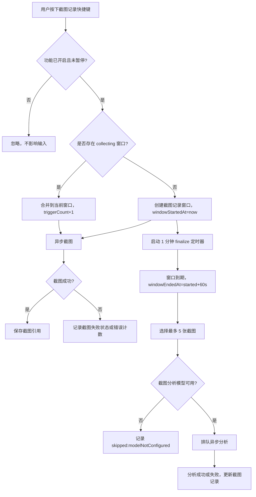
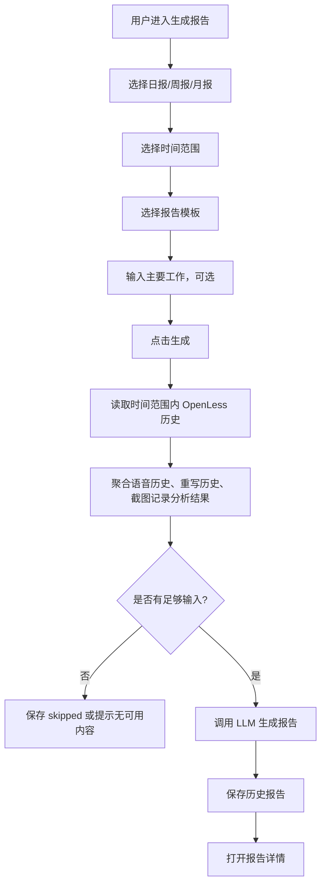

# 截图记录与周期报告生成目标模式 Spec

状态：ready for target mode  
优先级：P2  
日期：2026-06-26  
目标分支：`codex/context-capture`  
上游依据：

- `docs/context-capture-target-mode.md`
- `docs/context-vision-analysis-target-mode.md`
- 用户确认的产品决策：截图记录默认快捷键为 Enter、1 分钟合并、最多 5 张图提交截图分析、报告生成只使用 OpenLess 内部历史。

## 0. 目标模式执行契约

这份文档用于后续目标模式开发，执行时不需要再额外拆解。目标模式必须遵守：

- 以本文件为实现依据，优先形成可测试闭环，再补充边缘场景。
- 不改动 ASR、本地模型、语音润色主流程、文本重写插入策略、剪贴板回退策略。
- 不破坏已有语音历史、重写历史、上下文采集、截图分析结果。
- 新增“截图记录”和“历史报告”必须独立存储，不合并进 `history.json` 或 `rewrite-history.json`。
- 截图记录和报告生成均为旁路能力，失败不得影响用户输入、语音输入、文本重写、插入、剪贴板和历史保存。
- 所有截图分析继续复用既有“截图分析模型”配置，不新增独立 API Key。
- 当前版本不接入外部 AI 对话历史，只使用 OpenLess 自己的数据。

## 1. 目标

新增两组能力：

1. **截图记录**
   - 用户主动开启后，全局快捷键默认监听 `Enter`。
   - 用户按下快捷键时进行截图记录。
   - 连续快捷键触发按 1 分钟窗口合并为一条“截图记录”。
   - 单条记录最多提交 5 张截图给截图分析模型。
   - 分析完成后生成简要摘要和完整摘要，作为报告生成输入。

2. **周期报告生成**
   - 提供日报、周报、月报生成入口。
   - 用户可选择时间范围、模板、补充主要工作。
   - 生成输入来自 OpenLess 内部语音历史、重写历史、截图记录及其截图分析结果。
   - 生成结果保存到“历史报告”，不自动复制、不自动插入。
   - 支持每日定时生成日报，定时生成结果同样只保存到历史报告。

## 2. 本期范围

### 本期做

- 新增“截图记录”开关，默认关闭。
- 新增“截图记录”快捷键配置，默认 `Enter`，允许用户自定义。
- 新增托盘暂停/恢复入口，菜单命名为“截图记录：暂停记录 / 恢复记录”。
- 新增“截图记录”历史类型，历史页可查看。
- 新增截图记录持久化、截图文件关联、分析状态、失败状态。
- 新增 1 分钟合并窗口，窗口内连续触发合并为同一条记录。
- 新增最多 5 张截图提交给截图分析模型。
- 在历史页新增“截图分析提示词”弹窗设置入口，用于编辑完整摘要系统提示词。
- 新增报告模板管理：默认模板、编辑、创建、选择。
- 新增报告生成入口：日报、周报、月报，自选时间范围。
- 新增主要工作输入框，作为报告生成的用户补充信息。
- 新增历史报告入口，查看已生成报告。
- 新增每日定时生成日报开关和生成时间设置。

### 本期不做

- 不接入 Codex、Qoder、Alma、WorkBuddy 等外部 AI 对话历史。
- 不把报告自动插入当前输入框。
- 不把报告自动复制到剪贴板。
- 不做报告多人协作、云同步、分享链接。
- 不做复杂 OCR 引擎；报告使用已有截图分析结果中的结构化内容。
- 不做应用级或对话级外部上下文注入。
- 不做报告自动发送到微信、飞书、邮件或其他平台。
- 不做长期知识库、主题聚类和跨项目自动归类。

## 3. 已确认产品决策

| 决策 | 结果 |
| --- | --- |
| 截图记录默认状态 | 默认关闭，用户主动开启。 |
| 快捷键默认值 | 默认 `Enter`，用户可自定义。 |
| 触发范围 | OpenLess 开启且功能启用后，全局监听快捷键。 |
| 触发后行为 | 截图和分析异步执行，不阻塞用户输入。 |
| 托盘控制 | 托盘提供“截图记录：暂停记录 / 恢复记录”。 |
| LLM 配置缺失 | 只保存截图记录，不做分析。 |
| 分析模型 | 复用现有截图分析模型配置。 |
| 连续触发合并 | 1 分钟内连续触发截图记录快捷键合并为一条截图记录。 |
| 图片提交上限 | 单条截图记录最多提交 5 张图片给模型。 |
| 历史展示 | 历史页新增“截图记录”类型。 |
| 报告模板 | 默认模板 + 用户可编辑 + 用户可创建 + 用户可选择。 |
| 报告输出 | 只保存到历史报告。 |
| 定时日报 | 只保存到历史报告。 |

## 4. 当前代码现状

| 能力 | 当前现状 | 与本需求关系 |
| --- | --- | --- |
| 上下文采集 | 已支持语音/重写触发时采集窗口和截图 | 截图记录可复用截图采集、截图存储、截图读取 IPC 的设计。 |
| 截图分析 | 已支持截图 + 文本调用多模态 LLM 生成简要摘要和完整摘要 | 截图记录分析复用该模型配置、图片压缩、结构化解析和分析状态。 |
| 设置页 | 已有上下文采集和截图分析相关设置 | 需要新增截图记录开关、快捷键、报告模板和定时日报设置。 |
| 历史页 | 已有语音历史、重写历史和截图分析结果展示 | 需要新增截图记录历史类型，并在历史页提供截图分析提示词弹窗设置。 |
| 托盘 | 平台能力支持托盘 | 需要新增截图记录暂停/恢复入口。 |
| 报告能力 | 当前没有日报、周报、月报生成入口 | 本需求新增独立报告生成和历史报告模块。 |

## 5. 用户入口

### 5.1 设置页

新增或扩展设置区：

- `截图记录`
  - 开关：默认关闭。
  - 快捷键：默认 `Enter`，可自定义。
  - 状态：运行中 / 已暂停 / 快捷键注册失败 / 模型未配置。
  - 说明：开启后全局监听快捷键，截图和分析会在后台执行。

- `报告模板`
  - 日报默认模板。
  - 周报默认模板。
  - 月报默认模板。
  - 用户可编辑默认模板。
  - 用户可创建多个模板并选择使用。

- `定时日报`
  - 开关：默认关闭。
  - 时间：用户选择每日生成时间，格式为时分，不需要选择秒。
  - 默认时间：`18:00`。
  - 模板：无需单独选择，直接使用“生成报告”页中日报类型已选择的模板。
  - 数据范围：默认当天 00:00 到生成时间。

### 5.2 历史页截图分析提示词弹窗

在历史页新增“截图分析提示词”入口，打开弹窗后可编辑完整摘要系统提示词。

注意：入口文案可以继续叫“截图分析提示词”，但该配置的真实语义是“上下文分析完整摘要系统提示词”。它不仅影响截图记录，也会影响语音历史、重写历史、截图记录三类历史在后续分析或手动重新分析时生成的完整摘要。

规则：

- 入口放在历史页，不放在设置页。
- 提供恢复默认按钮。
- 保存前不需要立即重新分析历史。
- 修改后只影响新分析和用户手动重新分析。
- 弹窗说明必须提示用户：该提示词会影响语音历史、重写历史、截图记录的完整摘要，并会间接影响后续日报、周报、月报生成质量。

### 5.3 托盘菜单

新增菜单项：

- `截图记录：暂停记录` / `截图记录：恢复记录`
- 当功能未开启时，菜单显示禁用或引导去设置开启。
- 暂停状态只影响截图记录，不影响语音输入、文本重写、上下文采集和截图分析历史重试。

### 5.4 历史页

新增历史类型：`截图记录`。

规则：

- 与语音历史、重写历史并列。
- 列表不展示大图缩略图。
- 详情页展示：
  - 触发时间范围。
  - 来源应用和窗口标题。
  - 截图数量。
  - 采集状态。
  - 分析状态。
  - 简要摘要。
  - 完整摘要。
  - 截图预览。
  - 重新分析按钮。

### 5.5 报告入口

新增入口：`生成报告`。

表单字段：

- 报告类型：日报 / 周报 / 月报。
- 时间范围：支持自选开始和结束时间。
- 报告模板：在生成报告页选择已有模板。
- 主要工作：用户可选输入。
- 生成按钮。

生成完成后进入历史报告详情，不复制、不插入。

### 5.6 历史报告入口

新增入口：`历史报告`。

列表展示：

- 报告类型。
- 标题。
- 时间范围。
- 模板名称。
- 生成状态。
- 生成时间。

详情展示：

- 报告正文。
- 数据来源统计。
- 用户补充内容。
- 失败原因或跳过原因。

## 6. 数据模型

以下为目标模式实现建议，不要求字段名完全一致，但语义必须覆盖。

### 6.1 偏好设置

```ts
type UserPreferences = {
  screenshotRecordEnabled: boolean;          // 默认 false
  screenshotRecordPaused: boolean;           // 默认 false
  screenshotRecordHotkey: ShortcutBinding;   // 默认 Enter，无 modifiers
  screenshotRecordMergeWindowSeconds: number; // 默认 60
  screenshotRecordMaxImagesPerAnalysis: number; // 默认 5
  contextAnalysisFullSummaryPrompt: string | null;
  dailyReportScheduleEnabled: boolean;   // 默认 false
  dailyReportScheduleTime: string;        // 默认 "18:00"，格式 HH:mm
};
```

边界：

- 旧偏好缺少字段时必须可反序列化，使用默认值。
- `screenshotRecordMergeWindowSeconds` V1 固定为 60，可先不暴露给 UI。
- `screenshotRecordMaxImagesPerAnalysis` V1 固定为 5，可先不暴露给 UI。
- `screenshotRecordPaused=true` 不等同于 `screenshotRecordEnabled=false`，暂停可从托盘快速恢复。
- `dailyReportScheduleTime` 只保存时分，不保存秒。
- 定时日报不保存独立模板字段，运行时读取日报类型当前选择的模板。

### 6.2 截图记录

```ts
type ScreenshotRecordStatus =
  | 'collecting'
  | 'queued'
  | 'analyzing'
  | 'success'
  | 'failed'
  | 'skipped';

type ScreenshotRecord = {
  id: string;
  createdAt: string;
  updatedAt: string;
  windowStartedAt: string;
  windowEndedAt: string | null;
  status: ScreenshotRecordStatus;
  contextApp: string | null;
  conversationWindow: string | null;
  windowTitle: string | null;
  screenshotIds: string[];
  submittedScreenshotIds: string[];
  triggerCount: number;
  errorCode: string | null;
  errorMessage: string | null;
  analysis: ContextAnalysisResult | null;
};
```

存储要求：

- 独立存储，例如 `screenshot-records.json`。
- 截图文件复用或新增专用目录，例如 `enter-capture-screenshots/`。
- 不写入 `history.json` 或 `rewrite-history.json`。
- 清理策略默认跟随 `historyRetentionDays`。

### 6.3 报告模板

```ts
type ReportType = 'daily' | 'weekly' | 'monthly';

type ReportTemplate = {
  id: string;
  type: ReportType;
  name: string;
  content: string;
  isBuiltin: boolean;
  createdAt: string;
  updatedAt: string;
};
```

模板变量建议：

```text
{{dateRange}}
{{mainWork}}
{{voiceHistorySummary}}
{{rewriteHistorySummary}}
{{screenshotRecordSummary}}
{{actionItems}}
{{decisions}}
{{risks}}
```

规则：

- 内置模板不能删除。
- 用户编辑内置模板时，建议保存为用户覆盖版本或复制版本。
- 模板为空时禁止生成报告。

### 6.4 历史报告

```ts
type ReportGenerationStatus = 'pending' | 'success' | 'failed' | 'skipped';

type GeneratedReport = {
  id: string;
  reportType: ReportType;
  title: string;
  rangeStart: string;
  rangeEnd: string;
  templateId: string;
  templateName: string;
  userMainWork: string | null;
  status: ReportGenerationStatus;
  content: string | null;
  sourceStats: {
    voiceCount: number;
    rewriteCount: number;
    screenshotRecordCount: number;
    analyzedScreenshotRecordCount: number;
  };
  errorCode: string | null;
  errorMessage: string | null;
  createdAt: string;
  updatedAt: string;
};
```

存储要求：

- 独立存储，例如 `generated-reports.json`。
- 不覆盖历史报告，重复生成应新增一条报告。
- 删除历史源数据后，历史报告正文仍保留。

### 6.5 上下文分析结果

语音历史、重写历史、截图记录应复用同一种上下文分析结果语义。字段命名可沿用现有实现，但目标模式必须覆盖以下信息：

```ts
type ContextAnalysisSourceType = 'voice' | 'rewrite' | 'screenshotRecord';

type ContextAnalysisResult = {
  id: string;
  sourceType: ContextAnalysisSourceType;
  sourceRecordId: string;
  briefSummary: string | null;
  fullSummary: string | null;
  topic: string | null;
  userIntent: string | null;
  actionItems: ActionItem[];
  decision: string | null;
  risks: string[];
  detectedApp: string | null;
  conversationName: string | null;
  promptVersion: string | null;
  promptHash: string | null;
  modelId: string | null;
  createdAt: string;
  updatedAt: string;
};
```

规则：

- `sourceType` 必须保留到报告生成输入中，避免不同历史来源被混淆。
- `promptVersion` 或 `promptHash` 至少保存一个；如果当前实现已有等价字段，可以复用。
- 手动重新分析时创建新分析版本，旧版本不得覆盖新版本。
- 报告生成读取分析结果时，应优先读取最新 `success` 版本。

## 7. 截图记录流程



关键规则：

- 合并窗口从第一次触发开始固定计时 1 分钟。
- 不是“最后一次触发后等待 1 分钟”。
- 窗口到期后立即关闭，不再接收新的回车触发。
- 到期后如用户继续触发截图记录快捷键，创建下一条截图记录。
- 单条记录最多提交 5 张图给分析模型。

## 8. 选图策略

目标：保证上下文有代表性，同时控制成本、耗时和失败率。

V1 策略：

- 如果截图数量 `<= 5`，全部提交。
- 如果截图数量 `> 5`：
  - 必选第一张。
  - 必选最后一张。
  - 中间按时间均匀采样 3 张。

后续可优化：

- 基于图片 hash、直方图或窗口标题变化进行变化采样。
- 跳过重复截图。

V1 不做：

- 不为凑满 5 张而延迟提交。
- 不使用模型最大支持图片张数作为业务合并依据。
- 不提交超过 5 张图片。

## 9. 截图分析规则

复用既有截图分析模型、API Key、Base URL、图片压缩策略和结构化结果。

输入：

- 最多 5 张截图。
- 窗口标题、应用名、时间范围。
- 触发次数。
- 无用户原文时，文本输入为空或说明“该记录来自截图记录，无显式语音/重写原文”。

输出：

- 简要摘要。
- 完整摘要。
- 主题。
- 用户意图。
- 待办。
- 决策。
- 风险。

边界：

- LLM 未配置或模型为空：保存截图记录，分析状态 `skipped:modelNotConfigured`。
- 用户未授权截图分析：保存截图记录，分析状态 `skipped:consentRequired`。
- 图片读取或压缩失败：可跳过失败图片；若无可提交图片，则分析失败或跳过。
- 分析失败不影响后续截图记录和报告生成。

## 10. 历史页截图分析提示词设置

在历史页新增弹窗入口，用于编辑完整摘要系统提示词。

该提示词配置必须按统一上下文分析提示词处理，不得只绑定到“截图记录”。适用范围：

- 语音历史：截图 + 语音原文 + 润色结果 + 窗口元数据生成上下文分析。
- 重写历史：截图 + 重写原文 + 重写结果 + 窗口元数据生成上下文分析。
- 截图记录：最多 5 张截图 + 窗口元数据 + 触发次数生成上下文分析。

命名建议：

- UI 入口：`截图分析提示词`，保持用户已确认名称。
- 内部字段：`contextAnalysisFullSummaryPrompt`。
- 文案说明：`用于控制语音历史、重写历史、截图记录的完整摘要生成方式。完整摘要会作为后续日报、周报、月报的主要输入，请保持可复盘、可汇总，并避免把截图记录误写成已完成工作。`

规则：

- 默认值沿用当前截图分析系统提示词中的完整摘要要求。
- 用户修改后仅影响后续分析。
- 不自动重跑旧记录。
- 提供“恢复默认”。
- 保存空字符串时应阻止，或回退默认提示词。
- 不允许把 API Key、模型密钥等敏感信息写入提示词预览日志。
- 提示词不应要求模型输出大段 OCR 文本；只提取对归档、复盘、报告生成有用的信息。

完整摘要内容契约：

- `briefSummary`：用于后续提示词上下文，必须短、具体、低干扰，优先表达“用户正在什么上下文中做什么”。
- `fullSummary`：用于日报、周报、月报和历史回顾，是报告生成的主要输入材料。
- `fullSummary` 应包含：
  - 工作背景或上下文，例如项目、页面、对话、文档或任务。
  - 当前历史来源语义：语音历史是用户主动表达、记录或确认；重写历史是用户对选中文本做表达调整；截图记录是屏幕中正在查看、讨论或记录的上下文线索。
  - 用户本次语音、重写或截图记录对应的动作、意图或观察到的上下文。
  - 关键内容、结论、进展、待办、风险或后续价值。
  - 必要时说明信息来源是语音、重写还是截图记录，避免报告误判。
- `fullSummary` 不应包含：
  - 大段截图原文或聊天逐字转录。
  - 与任务无关的 UI 描述。
  - 模型推测出的未证实事实。
  - API Key、token、验证码、手机号、邮箱、地址、订单号等敏感信息原文。
- 截图记录的 `fullSummary` 默认不能写成用户已经完成的工作；只有截图或上下文中存在明确完成、提交、交付或确认结论证据时，才允许描述为进展或成果。
- 如果截图中能看到敏感信息，只允许泛化描述，例如“界面包含账号或身份信息”。

竞态：

- 分析任务开始时读取一次提示词快照。
- 分析过程中用户修改提示词，不影响正在进行的任务。
- 新任务使用新提示词。
- 手动重新分析使用当时最新提示词。
- 分析结果必须记录提示词版本、哈希或摘要字段，便于解释同一条历史前后摘要差异。
- 旧分析任务晚返回时，不得覆盖使用更新提示词启动的分析结果。

## 11. 完整摘要与报告生成衔接

完整摘要是报告生成的主要结构化原料。目标模式实现时必须把“摘要生成”和“报告生成”作为上下游契约处理，而不是两个互不相关的 LLM 调用。

### 11.1 三类历史的摘要口径

语音历史、重写历史、截图记录都应产出同一种上下文分析结果结构，至少包括：

- `briefSummary`
- `fullSummary`
- `topic`
- `userIntent`
- `actionItems`
- `decision`
- `risks`
- `detectedApp`
- `conversationName`
- `sourceType`：`voice | rewrite | screenshotRecord`

不同历史的输入不同，但输出字段语义必须一致：

- 语音历史：重点解释用户说了什么、要输入或确认什么。
- 重写历史：重点解释用户把什么内容重写成什么方向，以及重写背后的上下文。
- 截图记录：重点解释该时间窗口内屏幕上下文发生了什么，以及对后续复盘是否有价值。截图记录默认是“上下文线索”，不是“完成事项”。

### 11.2 报告生成输入优先级

报告生成聚合历史时，按以下优先级组织输入：

1. 用户在“主要工作”中主动输入的内容。
2. 各历史记录的 `fullSummary`。
3. 各历史记录的 `briefSummary`。
4. 语音原文、重写原文、重写结果等文本字段。
5. 截图记录元数据，例如应用名、窗口标题、触发时间、截图数量。

规则：

- 如果 `fullSummary` 存在，报告生成默认不再提交原始截图给报告模型。
- 如果 `fullSummary` 缺失，但 `briefSummary` 存在，可以使用 `briefSummary` 作为降级材料。
- 如果摘要都缺失，可以使用原始文本和元数据作为降级材料，但必须标记来源可信度较低。
- 用户“主要工作”优先级最高；当它与历史摘要冲突时，以用户输入为准，并在必要时使用“历史记录显示...”描述差异，不得自行编造调和结论。
- 报告 prompt 必须保留 source type，避免把“截图里看到的内容”误写成“用户已完成的工作”。
- 报告 prompt 必须明确：语音历史和重写历史可以提取用户动作、表达目标和确认事项；截图记录需要有明确完成、提交、交付、确认结论证据，才可写入成果或进展，否则应归入背景、待确认、风险或后续计划。

### 11.3 报告材料组织

报告生成前建议把历史聚合为中间材料，而不是把原始记录直接拼进 prompt：

```text
时间范围：
报告类型：
用户主要工作：

语音历史摘要：
- [时间][应用/对话][主题][完整摘要][待办/风险]

重写历史摘要：
- [时间][应用/对话][主题][完整摘要][待办/风险]

截图记录摘要：
- [时间范围][应用/对话][主题][完整摘要][待办/风险]

数据缺口：
- 未分析、分析失败、摘要缺失的记录数量
```

报告模型应基于该中间材料和用户选择的模板生成最终报告。

### 11.4 提示词设计约束

完整摘要提示词必须服务于后续报告，不应只描述截图画面。默认提示词需要明确要求模型：

- 输出可用于日报、周报、月报的事实性摘要。
- 优先提取工作内容、进展、结论、待办、风险、协作对象和项目上下文。
- 对截图记录，区分“屏幕中正在查看/讨论”与“用户已经完成”。
- 对语音和重写记录，结合用户原文与截图上下文解释本次输入或重写的业务含义。
- 不输出长篇 OCR，不泄露敏感信息，不补充截图和原文之外的事实。

## 12. 报告生成流程



数据来源：

- 语音历史。
- 重写历史。
- 截图记录。
- 截图记录的简要摘要和完整摘要。
- 用户输入的主要工作。

不使用：

- Codex、Qoder、Alma、WorkBuddy 等外部 AI 对话历史。
- 未经分析的截图原图，除非后续另行确认。
- 当前窗口实时内容。

## 13. 报告生成提示词边界

报告生成 prompt 应明确：

- 报告类型。
- 时间范围。
- 用户主要工作。
- 数据来源统计。
- 历史摘要合集。
- 模板内容。

要求：

- 严格按模板输出。
- 不编造未出现在历史和用户输入中的事实。
- 对不确定事项使用“可能/待确认”。
- 合并重复事项。
- 优先保留结论、进展、待办、风险和下一步。

## 14. 定时日报

规则：

- 默认关闭。
- 用户设置每日生成时间，默认 `18:00`。
- 时间选择只到时分，格式为 `HH:mm`，不需要选择秒。
- 到点后按当天时间范围生成日报。
- 只保存到历史报告。
- 不复制、不插入、不自动打开。

默认数据范围：

```text
当天 00:00:00 到触发生成时刻
```

边界：

- 应用未运行时，不强制补生成，除非后续明确要求。
- 到点时如果已有正在生成的日报任务，跳过本次或排队，不并发生成同一份日报。
- 同一天同一模板的定时日报重复触发时，默认不覆盖旧报告，保存新报告或记录 skipped:duplicateInProgress。

## 15. 竞态处理

### 15.1 截图记录快捷键触发与窗口关闭

场景：窗口到期瞬间，用户又按了一次截图记录快捷键。

规则：

- 以单调时间或受锁保护的窗口状态判断。
- 如果触发时间 `<= windowStartedAt + 60s`，归入旧记录。
- 如果触发时间 `> windowStartedAt + 60s`，创建新记录。
- finalize 只允许执行一次，使用状态从 `collecting -> queued` 的原子过渡。

### 15.2 多次快速触发截图记录快捷键

场景：用户连续快速按截图记录快捷键。

规则：

- 快捷键 handler 只做轻量入队，不直接截图和分析。
- 使用单 worker 或受锁队列串行更新当前 collecting 记录。
- `triggerCount` 递增必须在锁内完成。
- 截图任务可异步，但写入截图列表时必须校验记录仍存在。

### 15.3 截图任务晚于 finalize

场景：某次回车触发的截图很慢，记录已经 finalize。

规则：

- 如果截图开始时间属于该 1 分钟窗口，可允许写入该记录。
- finalize 选图时应等待一个很短的截图收尾窗口，例如 1-2 秒。
- 超过收尾窗口仍未完成的截图，完成后不参与本次分析，可丢弃或标记 orphan 并清理。
- 不允许因为截图慢而长期阻塞分析。

### 15.4 分析任务与重新分析

场景：用户在历史详情点击重新分析，同时后台自动分析还在进行。

规则：

- 同一截图记录同一时间只允许一个 active 分析任务。
- 重新分析请求如发现 `analyzing`，按钮保持禁用或提示“分析中”。
- 重新分析应生成新的 analysis id 或版本号。
- 旧任务晚返回时，不得覆盖新任务结果。
- 使用 `analysisGeneration`、`analysisId` 或 `startedAt` 做过期结果保护。

### 15.5 设置开关变化

场景：用户开启后立即关闭，或暂停后恢复。

规则：

- `screenshotRecordEnabled=false` 后，不再接收新触发。
- 已经 collecting 的记录应立即 finalize 或标记 `skipped:disabledDuringCollection`，目标模式二选一，但必须一致。
- 建议：关闭功能时 finalize 当前记录，保存已采集截图，但不再继续分析。
- `screenshotRecordPaused=true` 只停止新触发，不删除当前记录。

### 15.6 快捷键冲突

场景：截图记录默认快捷键 `Enter` 与用户输入行为天然重合。

规则：

- 功能默认关闭。
- 设置页必须提示这是高频全局快捷键。
- 快捷键注册失败时显示错误，不影响其他快捷键。
- 用户自定义快捷键与语音、重写、打开应用等已有快捷键冲突时，应阻止保存或提示冲突。
- 截图记录快捷键不得拦截或吞掉原始 Enter 事件。

### 15.7 报告生成与历史清理

场景：报告生成时，历史保留策略正在清理旧记录。

规则：

- 报告生成开始时读取一份历史快照。
- 后续历史清理不影响当前生成。
- 报告保存 sourceStats 和正文。
- 历史源数据被清理后，已生成报告仍可查看。

### 15.8 定时任务重复触发

场景：系统睡眠恢复、应用重启或时间跳变导致定时日报重复触发。

规则：

- 每次定时生成使用 date key，例如 `daily:2026-06-26:templateId`。
- 同一 date key 如果已有 `pending/analyzing`，不再创建新任务。
- 如果已有 `success`，默认不重复生成，除非用户手动点击生成。
- 系统时间异常时记录 skipped 状态，不阻断应用。

### 15.9 模板编辑与报告生成

场景：报告生成中用户修改模板。

规则：

- 报告生成开始时保存模板快照。
- 历史报告记录模板名称和模板内容快照或模板版本。
- 生成中模板变化不影响当前任务。

### 15.10 LLM 配置变化

场景：分析或报告生成中，用户切换模型或清空 API Key。

规则：

- 每个任务开始时读取模型配置快照。
- 任务中途配置变化不影响当前请求。
- 新任务使用新配置。
- 如果请求返回鉴权失败，只标记该任务失败，不全局关闭功能。

## 16. 边界条件

### 16.1 截图记录

- 功能关闭：不注册或不响应快捷键。
- 功能暂停：不创建新记录。
- 平台不支持全局快捷键：设置区显示不可用。
- 平台不支持截图：创建失败记录或跳过，主流程不受影响。
- 截图文件缺失：历史详情显示“截图不可用”。
- 1 分钟窗口内没有任何成功截图：记录失败或 skipped，不分析。
- 图片超过 5 张：只提交选中的 5 张。
- 图片压缩失败：跳过失败图片；全部失败则分析失败。
- 模型为空：只保存截图，不分析。
- API Key 缺失：只保存截图，不分析或标记 skipped。
- 网络失败：记录 failed，可手动重试。

### 16.2 历史展示

- 语音历史、重写历史、截图记录三类必须隔离。
- 清空截图记录不得清空语音历史和重写历史。
- 清空语音历史不得清空截图记录，除非清理的是共享上下文截图文件且已无引用。
- 列表不显示大图，避免性能问题。
- 详情页截图懒加载并缓存。

### 16.3 报告生成

- 时间范围为空或结束早于开始：禁止生成。
- 模板为空：禁止生成。
- 所选范围没有任何历史：提示无可用内容，不调用 LLM。
- LLM 未配置：保存 failed 或阻止生成，并提示配置模型。
- 生成失败：保存失败报告记录，允许重试。
- 用户主要工作为空：允许生成。
- 历史摘要过长：按时间和重要性截断，保留 sourceStats。

## 17. IPC / 命令能力建议

目标模式可按现有命令风格命名，不要求完全一致。

截图记录：

- `list_screenshot_records`
- `delete_screenshot_record`
- `clear_screenshot_records`
- `read_screenshot_record_image`
- `reanalyze_screenshot_record`

报告模板：

- `list_report_templates`
- `save_report_template`
- `delete_report_template`
- `reset_report_template`

报告：

- `generate_report`
- `list_generated_reports`
- `get_generated_report`
- `delete_generated_report`

设置：

- 复用现有设置保存命令。
- 新增字段必须兼容旧配置。

## 18. 文件清单建议

目标模式优先检查和修改：

- `openless-all/app/src-tauri/src/types.rs`
- `openless-all/app/src/lib/types.ts`
- `openless-all/app/src-tauri/src/context_capture.rs`
- `openless-all/app/src-tauri/src/context_vision_analysis.rs`
- `openless-all/app/src-tauri/src/persistence/mod.rs`
- `openless-all/app/src-tauri/src/persistence/context_capture.rs`
- 新增 `persistence/screenshot_record.rs`
- 新增 `persistence/report_template.rs`
- 新增 `persistence/generated_report.rs`
- `openless-all/app/src-tauri/src/commands/history.rs`
- 新增或扩展 `commands/report.rs`
- `openless-all/app/src/pages/History.tsx`
- 新增或扩展报告页面组件
- `openless-all/app/src/pages/settings/DebugToolsSection.tsx` 或新增设置区
- 托盘初始化相关文件

## 19. 验收标准

截图记录：

- [ ] 默认关闭，安装后不会自动记录回车。
- [ ] 开启后按 Enter 能创建截图记录。
- [ ] 1 分钟内连续触发截图记录快捷键合并为同一条截图记录。
- [ ] 1 分钟后继续触发截图记录快捷键创建新截图记录。
- [ ] 单条记录最多提交 5 张图片给截图分析模型。
- [ ] LLM 或模型未配置时，只保存截图记录，不执行分析。
- [ ] 截图/分析失败不影响用户正常回车输入。
- [ ] 托盘“截图记录：暂停记录”后不再新增截图记录，恢复后继续生效。
- [ ] 历史页新增“截图记录”，不影响语音历史和重写历史。

提示词设置：

- [ ] 可以在历史页弹窗中编辑完整摘要系统提示词。
- [ ] 可以恢复默认提示词。
- [ ] 修改提示词只影响新分析。
- [ ] 弹窗说明明确提示该设置影响语音历史、重写历史、截图记录的完整摘要。
- [ ] 新生成的语音历史、重写历史、截图记录分析结果都记录提示词版本或哈希。
- [ ] 修改提示词不会自动重跑旧记录；手动重新分析使用最新提示词。

报告生成：

- [ ] 可以选择日报、周报、月报。
- [ ] 可以自选时间范围。
- [ ] 可以选择模板。
- [ ] 可以输入主要工作。
- [ ] 只使用 OpenLess 内部历史数据。
- [ ] 优先使用各历史记录的完整摘要生成报告，完整摘要缺失时再降级使用简要摘要、原始文本和元数据。
- [ ] 用户输入的主要工作优先级高于历史摘要。
- [ ] 报告生成保留语音、重写、截图记录的来源类型，避免把截图中看到的内容误写成已完成工作。
- [ ] 生成结果保存到历史报告。
- [ ] 不自动复制，不自动插入。

定时日报：

- [ ] 默认关闭。
- [ ] 开启后可设置生成时间，时间格式为 HH:mm，默认 18:00。
- [ ] 到点生成日报并保存到历史报告。
- [ ] 重复触发不会并发生成多份相同日报。
- [ ] 定时日报使用生成报告页中日报已选择的模板，不提供单独模板选择。

## 20. 测试计划

### Rust

- `cargo check --no-default-features`
- 新增单元测试：
  - 旧偏好反序列化默认值。
  - 1 分钟窗口合并。
  - 5 张图选图策略。
  - 同一记录分析结果过期保护。
  - 提示词版本或哈希快照。
  - 报告输入聚合优先级：用户主要工作 > 完整摘要 > 简要摘要 > 原始文本 > 元数据。
  - 报告模板 CRUD。
  - 历史报告保存和读取。
  - 定时日报重复 date key 保护。

### Frontend

- `.\node_modules\.bin\tsc.CMD --noEmit`
- `npm run build`
- 手工验证：
  - 设置开关和快捷键。
  - 托盘暂停/恢复。
  - 历史页三类历史切换。
  - 截图记录详情。
  - 历史页截图分析提示词弹窗。
  - 修改提示词后，新分析结果使用新提示词，旧结果不自动变化。
  - 报告生成和历史报告查看。

### 手工回归

- 语音输入仍可录音、润色、插入、保存历史。
- 文本重写仍可选区、重写、替换、剪贴板回退、保存历史。
- 截图分析历史单条重试仍可用。
- 关闭截图记录后不产生截图记录。
- 清空截图记录不影响语音历史和重写历史。
- 使用同一时间范围内的语音历史、重写历史、截图记录生成日报，确认报告优先消费完整摘要，且不会把截图观察误写成用户已完成事项。

## 21. 目标模式执行顺序

1. 类型与偏好字段。
2. 截图记录存储和 1 分钟合并状态机。
3. 全局快捷键注册和托盘暂停。
4. 截图采集复用与最多 5 图选图。
5. 截图记录分析复用。
6. 历史页新增“截图记录”。
7. 完整摘要提示词设置。
8. 报告模板存储和设置 UI。
9. 报告生成和历史报告存储。
10. 定时日报。
11. 全量验证和人工回归。

## 22. 暂不解决的问题

- 外部 AI 桌面端对话上下文识别。
- 报告自动复制、自动插入、自动发送。
- 报告云同步和多设备查看。
- 截图记录按应用、窗口、主题聚合。
- 基于图片变化的智能采样。


