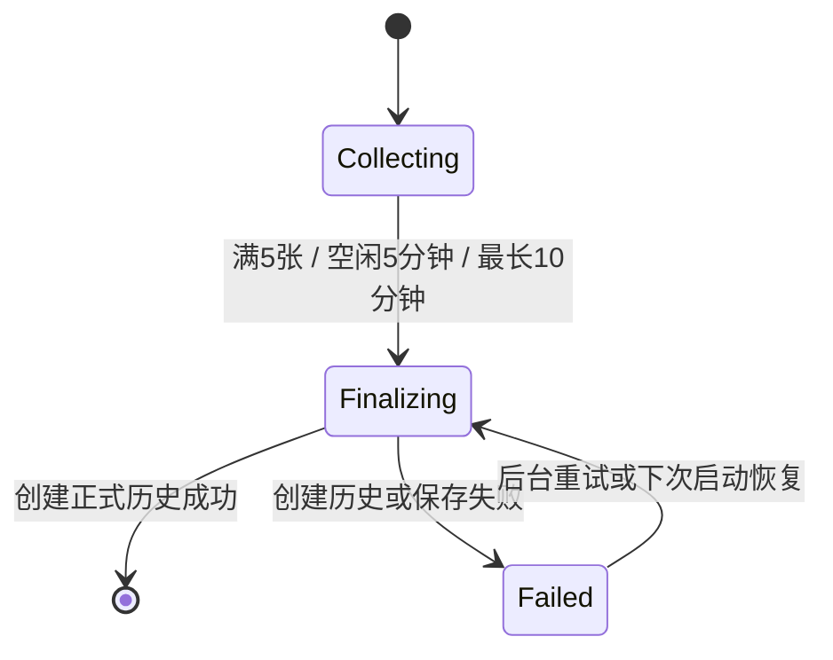
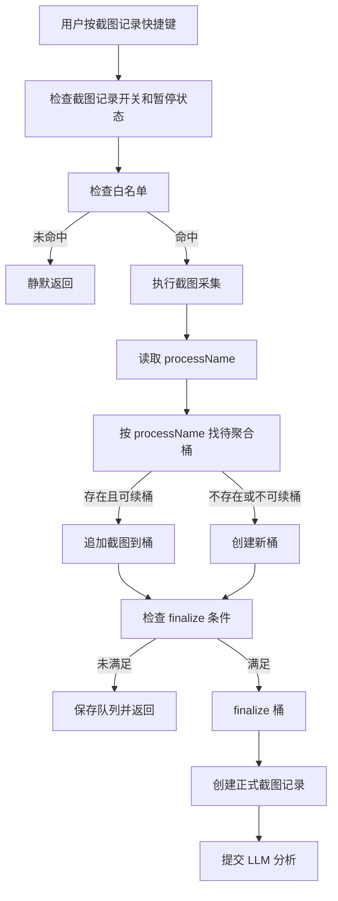

# 截图记录按应用聚合分析目标模式 Spec

状态：future target mode / not in whitelist V1  
优先级：P2  
日期：2026-06-27  
目标分支建议：基于完成后的截图白名单分支另开，例如 `codex/screenshot-app-aggregation`  
上游依据：

- `docs/report-generation-and-enter-capture-target-mode.md`
- `docs/screenshot-whitelist-target-mode.md`
- `docs/future-screenshot-aggregation-notes.md`
- 用户确认的产品决策：该能力只影响截图记录；默认关闭；按应用进程聚合；待聚合不进入历史列表；聚合完成后按应用生成正式截图记录。

## 0. 目标模式执行契约

这份文档用于后续独立目标模式开发，不属于截图白名单 V1。

目标模式必须遵守：

- 不改动语音输入、文本重写、ASR、本地模型、插入、剪贴板回退主流程。
- 不影响语音历史和重写历史的上下文截图与分析。
- 白名单仍然是截图记录的前置过滤层；未命中白名单时不进入待聚合队列。
- 待聚合队列不是正式历史，不进入普通历史列表，不进入报告生成。
- 聚合完成后才生成正式“截图记录”历史。
- 分析成功的正式截图记录才能进入日报、周报、月报材料。
- 失败、待聚合、分析中记录不得进入报告材料。

## 1. 背景

当前截图记录以快捷键触发为单位进行截图，并在短时间内做简单合并。这个模式反馈快，但在真实工作流中会遇到一个问题：用户可能在多个应用之间交错操作，例如：

```text
10:00 企业微信截图
10:02 Alma 截图
10:04 企业微信截图
10:05 企业微信截图
```

如果按全局连续时间合并，可能混入不同应用上下文；如果每次都拆成独立历史，又会让历史变碎，不利于报告生成。

本需求引入“按应用聚合分析”：截图先进入待聚合队列，按应用进程分桶；满足提交条件后，再按应用生成正式截图记录并提交 LLM 分析。

## 2. 目标

新增截图记录高级能力：`按应用聚合分析`。

- 默认关闭。
- 只影响截图记录。
- 截图记录命中白名单后，先进入待聚合队列。
- 队列按 `processName` 分桶。
- 同应用 5 分钟内有新截图，继续归入同桶。
- 单桶满 5 张立即提交。
- 单桶 5 分钟无新截图则提交。
- 单桶从第一张开始最长 10 分钟必须提交。
- 提交后按应用生成正式截图记录历史。
- 一次 finalize 如包含多个应用桶，生成多条正式截图记录。
- 截图记录页顶部展示轻量待聚合状态条。
- 不提供“立即分析”按钮。
- 分析失败可手动重新分析，使用同一批图。

## 3. 本期范围

### 本期做

- 新增高级开关：`按应用聚合分析`，默认关闭。
- 新增待聚合队列持久化存储。
- 新增按 `processName` 分桶的聚合状态机。
- 新增 3 类 finalize 条件：
  - 满 5 张立即提交。
  - 5 分钟无新截图提交。
  - 单桶最长 10 分钟强制提交。
- 聚合完成后生成正式截图记录历史。
- 正式历史复用现有截图记录分析流程。
- 截图记录页顶部展示待聚合状态条。
- 重启应用后恢复待聚合队列，并 finalize 已过期桶。
- 失败记录支持手动重新分析，使用同一批 `submittedScreenshotIds`。

### 本期不做

- 不影响语音历史。
- 不影响重写历史。
- 不做窗口标题、对话窗口、网页 URL 级聚合。
- 不做跨应用聚合。
- 不提供手动“立即分析”。
- 不让待聚合、分析中、失败记录进入报告。
- 不做云同步。
- 不做长期主题聚类。

## 4. 已确认产品决策

| 决策 | 结果 |
| --- | --- |
| 作用范围 | 只影响截图记录。 |
| 默认状态 | 默认关闭，作为高级选项。 |
| 白名单关系 | 白名单是前置过滤，未命中不进入队列。 |
| 聚合单位 | `processName`。 |
| 续桶规则 | 同应用 5 分钟内继续归同桶。 |
| 强制提交 | 单桶最长 10 分钟必须提交。 |
| 满桶提交 | 单桶满 5 张立即提交。 |
| 空闲提交 | 单桶 5 分钟无新截图则提交。 |
| 历史展示 | 待聚合不进入普通历史列表。 |
| 待聚合反馈 | 截图记录页顶部状态条展示。 |
| 正式历史 | 聚合完成后按应用生成正式截图记录。 |
| 多应用 finalize | 一次 finalize 可生成多条正式截图记录。 |
| 提前分析 | 不提供。 |
| 失败重试 | 可手动重新分析，使用同一批图。 |
| 报告使用 | 只使用分析成功的正式截图记录。 |

## 5. 数据模型

### Preferences

```ts
interface Preferences {
  screenshotAppAggregationEnabled: boolean;
}
```

默认值：

- `screenshotAppAggregationEnabled = false`

### 待聚合桶

建议新增独立存储文件，例如：

```text
screenshot-aggregation-buffer.json
```

类型：

```ts
type ScreenshotAggregationBucketStatus =
  | "collecting"
  | "finalizing"
  | "failed";

interface ScreenshotAggregationBucket {
  id: string;
  processName: string;
  appDisplayName?: string | null;
  firstCapturedAt: string;
  lastCapturedAt: string;
  status: ScreenshotAggregationBucketStatus;
  screenshotIds: string[];
  triggerCount: number;
  errorCode?: string | null;
  errorMessage?: string | null;
}
```

说明：

- `processName` 入库前统一小写。
- `screenshotIds` 引用已保存的上下文截图或截图记录截图。
- 待聚合桶不是正式历史。
- 待聚合桶不进入报告。
- 待聚合桶需要持久化，避免应用重启或崩溃导致截图丢失。

### 正式截图记录扩展

正式 `ScreenshotRecord` 建议保留或新增以下字段：

```ts
interface ScreenshotRecord {
  aggregationBucketId?: string | null;
  aggregationMode?: "immediate" | "app";
  processName?: string | null;
}
```

要求：

- 聚合生成的正式历史必须记录来源桶 ID。
- `submittedScreenshotIds` 必须固定保存，用于失败后重新分析同一批图。

## 6. 状态机

### 待聚合桶状态



### 正式截图记录状态

正式截图记录继续沿用现有状态语义：

- `queued`
- `analyzing`
- `success`
- `failed`

聚合能力只改变正式历史创建前的收集方式，不改变 LLM 分析结果结构。

## 7. 核心流程

### 截图触发流程



### 可续桶条件

同一 `processName` 下，满足全部条件才可续桶：

- 桶状态为 `collecting`。
- 当前截图时间距离 `lastCapturedAt` 不超过 5 分钟。
- 当前截图时间距离 `firstCapturedAt` 不超过 10 分钟。
- 桶内截图数小于 5。

否则创建新桶。

### Finalize 条件

任一条件满足即 finalize：

- 桶内截图数达到 5。
- 当前时间距离 `lastCapturedAt` 超过或等于 5 分钟。
- 当前时间距离 `firstCapturedAt` 超过或等于 10 分钟。

### 创建正式历史

Finalize 时：

1. 从桶内截图中选择提交图片。
2. 创建正式 `ScreenshotRecord`。
3. 设置 `aggregationMode = "app"`。
4. 设置 `aggregationBucketId`。
5. 设置 `submittedScreenshotIds`。
6. 删除或归档待聚合桶。
7. 启动现有截图分析流程。

选图策略：

- 桶内最多 5 张图。
- 如果后续允许桶内超过 5 张，仍使用当前最多 5 图策略：第一张、最后一张、中间均匀采样。

## 8. UI / UX

### 设置入口

建议放在截图记录高级设置区。

开关：

```text
按应用聚合分析
```

说明：

```text
开启后，截图记录会先按应用暂存聚合，再提交分析。待聚合内容不会进入历史和报告。
```

默认关闭。

### 截图记录页顶部状态条

待聚合队列不进入普通历史列表，但需要轻量反馈。

示例：

```text
待聚合：企业微信 3 张，Alma 1 张
```

交互要求：

- 只在存在待聚合桶时展示。
- 展示应用名称和截图数量。
- 不提供“立即分析”按钮。
- 可提供刷新或折叠，但不是必须。
- 不展示截图缩略图，避免视觉干扰和隐私风险。

### 正式历史列表

聚合完成后才出现正式截图记录。

列表可展示：

- 应用名称
- 时间范围
- 截图数量
- 分析状态

## 9. 报告生成规则

报告生成只使用正式截图记录，且必须满足：

- 状态为 `success`。
- 有可用 `fullSummary` 或结构化分析结果。

不得使用：

- 待聚合桶。
- `queued`。
- `analyzing`。
- `failed`。
- 只有截图但没有分析成功的记录。

## 10. 失败处理

### 截图采集失败

- 不写入待聚合桶。
- 不创建正式历史。
- 不影响用户输入。

### 队列保存失败

- 记录日志。
- 不创建正式历史。
- 不调用 LLM。

### Finalize 失败

- 桶状态置为 `failed`。
- 保留截图引用。
- 下次启动或后台重试可再次 finalize。

### LLM 分析失败

- 正式截图记录状态为 `failed`。
- 保留 `submittedScreenshotIds`。
- 用户可手动重新分析。
- 重新分析必须使用同一批图。
- 失败记录不进入报告。

## 11. 边界条件

### 白名单未命中

- 不截图。
- 不进入待聚合队列。
- 不创建正式历史。

### 白名单关闭

- 按截图记录总开关规则允许截图。
- 如果按应用聚合分析开启，则仍按 `processName` 聚合。

### 进程识别失败

- 如果无法获取 `processName`，不进入待聚合队列。
- 不创建正式历史。

### 应用切换

- 不同 `processName` 写入不同桶。
- 不跨应用混合。
- 一次后台 finalize 可同时 finalize 多个过期桶，并生成多条正式历史。

### 应用持续活跃

- 即使 5 分钟内持续有新截图，单桶从第一张开始满 10 分钟必须 finalize。
- Finalize 后同应用新截图进入新桶。

### 单桶满 5 张

- 立即 finalize。
- 第 6 张如果继续触发，进入新桶。

### 应用重启

- 待聚合队列持久化。
- OpenLess 启动时读取队列。
- 已过期桶应在启动后 finalize。
- 找不到截图文件的桶应标记失败或跳过缺失截图，不得崩溃。

### 删除截图记录

- 删除正式截图记录时按现有逻辑删除关联截图。
- 不影响已 finalize 删除的聚合桶。

### 清理策略

- 待聚合桶应跟随截图记录保留周期清理。
- 已经生成正式历史的桶应删除或归档，不长期保留。
- 清理失败只记录日志。

## 12. 竞态处理

### 快捷键并发触发

连续 Enter 可能快速触发多次。

- 待聚合队列写入必须串行化。
- 同一 `processName` 的桶追加必须加锁或通过单线程任务队列处理。
- 不得出现同一应用同时创建两个可续桶。

### Finalize 与追加同时发生

如果桶正在 finalize，又收到同应用新截图：

- 正在 finalize 的桶不得再追加。
- 新截图创建新桶。

### 满 5 张与空闲定时器同时触发

- Finalize 必须幂等。
- 同一桶只能创建一条正式截图记录。
- 可通过桶状态 `finalizing` 防重入。

### 应用关闭或切换

- 聚合基于截图触发时读取的 `processName`。
- 后续应用关闭不影响已入桶截图。

### 应用退出前仍有待聚合桶

- 关闭应用时不强制同步 LLM 分析。
- 待聚合桶已持久化即可。
- 下次启动后继续判断是否过期并 finalize。

### 历史清理与待聚合桶

- 如果截图文件已被清理，桶 finalize 时应跳过缺失截图或标记失败。
- 不得因为待聚合桶重新创建已删除的截图文件。

### 重新分析

- 重新分析只作用于正式截图记录。
- 不重新打开待聚合桶。
- 使用原 `submittedScreenshotIds`。

## 13. IPC

建议新增：

```ts
setScreenshotAppAggregationEnabled(enabled: boolean): Promise<Preferences>
getScreenshotAggregationStatus(): Promise<ScreenshotAggregationStatus>
```

类型：

```ts
interface ScreenshotAggregationStatus {
  buckets: ScreenshotAggregationStatusBucket[];
}

interface ScreenshotAggregationStatusBucket {
  id: string;
  processName: string;
  appDisplayName?: string | null;
  screenshotCount: number;
  firstCapturedAt: string;
  lastCapturedAt: string;
}
```

不建议 V1.1 暴露手动 finalize IPC，除非后续确认需要“立即分析”。

## 14. 测试计划

### Rust 单元测试

- 同一应用 5 分钟内续桶。
- 同一应用超过 5 分钟创建新桶或 finalize 旧桶。
- 单桶满 5 张立即 finalize。
- 单桶最长 10 分钟强制 finalize。
- 不同 `processName` 进入不同桶。
- 正在 finalizing 的桶不再追加。
- 同一桶 finalize 幂等，只创建一条正式历史。
- LLM 失败后重新分析使用同一批 `submittedScreenshotIds`。
- 待聚合桶不进入报告查询。

### 前端测试

- 高级开关默认关闭。
- 开启后截图记录页出现待聚合状态条。
- 待聚合状态条只显示应用和数量，不进入历史列表。
- 聚合完成后正式历史出现。
- 失败记录可手动重新分析。

### 手工验证

1. 企业微信连续 3 次截图，5 分钟内继续触发，仍在同一待聚合桶。
2. 企业微信 3 次截图，中间 Alma 1 次截图，两个应用分别进入不同桶。
3. 企业微信满 5 张后立即生成正式截图记录。
4. Alma 只有 1 张，5 分钟无新截图后生成正式截图记录。
5. 持续触发同一应用，10 分钟后强制生成正式记录。
6. 报告生成只使用分析成功记录，不使用待聚合、分析中或失败记录。
7. 重启 OpenLess 后，待聚合桶仍能恢复并按过期规则 finalize。

## 15. 验收标准

- 功能默认关闭。
- 只影响截图记录。
- 白名单未命中不进入待聚合队列。
- 待聚合队列按 `processName` 分桶。
- 满 5 张、空闲 5 分钟、最长 10 分钟三类 finalize 条件生效。
- 待聚合不进入普通历史列表。
- 截图记录页顶部能展示待聚合状态。
- 聚合完成后按应用生成正式截图记录。
- 一次 finalize 多个应用桶时生成多条正式历史。
- 失败记录可手动重新分析，且使用同一批图。
- 待聚合、分析中、失败记录不进入报告生成。

## 16. 实施顺序

1. 新增偏好项和设置 UI 开关。
2. 新增待聚合桶类型和持久化 store。
3. 新增聚合状态机和 finalize 条件。
4. 接入截图记录触发流程，白名单之后进入聚合队列。
5. 聚合 finalize 后创建正式截图记录。
6. 复用现有截图分析任务。
7. 截图记录页增加待聚合状态条。
8. 报告查询排除待聚合、分析中、失败记录。
9. 补单元测试和人工验证。

## 17. 风险

- 分析结果不再即时出现，用户需要理解“待聚合”状态。
- 状态机复杂度明显高于即时截图记录。
- 待聚合截图需要持久化，必须处理文件清理和崩溃恢复。
- 如果截图记录页不展示状态条，用户可能误以为按键无效。
- 如果状态条展示过多信息，可能增加隐私暴露风险；因此只展示应用和数量。

