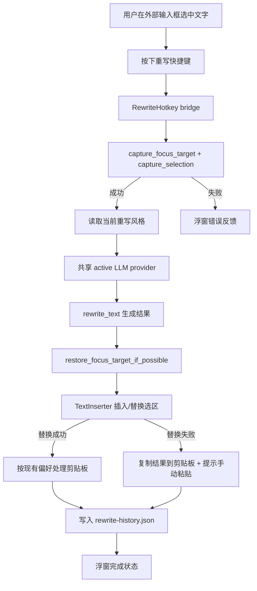

# 文本重写功能规划文档

状态：Draft  
日期：2026-06-22  
适用范围：VoxHub / OpenLess 当前版本，主要应用目录 `openless-all/app/`  
当前阶段：规划与技术路线梳理，不进入编码实现

## 1. 背景与目标

VoxHub 当前核心链路是“录音 -> ASR 转文字 -> LLM 润色 -> 插入到光标位置 -> 历史记录”。本规划新增一个独立的文本重写能力：用户在任意应用输入框或可编辑区域内选中文字后，按下自定义快捷键，系统读取选区文本，调用与现有语音润色共享的 LLM 服务实例，按用户选择的重写风格包生成新文本，并优先直接替换原选区；替换失败时保留结果到系统剪贴板，用户可手动粘贴。

本阶段只产出开发规划，为后续 `VIBE_CODING_RULES.md` 目标模式开发提供依据。

## 2. 明确假设

- 平台优先级：Windows 优先，同时保留 macOS/Linux 的架构兼容位；Android 暂不作为首期范围。
- 选区获取：首期复用现有 `selection.rs` 的划词读取能力；若目标应用不允许读取或复制选区，给出错误反馈，不尝试 OCR 或复杂无障碍树遍历。
- 插入策略：首期复用 `insertion.rs::TextInserter`，即“写剪贴板 -> 模拟粘贴”；对于选中文本场景，粘贴会自然替换当前选区。
- 剪贴板要求：与现有插入能力保持一致。成功插入/替换时按 `restore_clipboard_after_paste` 偏好决定是否恢复原剪贴板；只有插入/替换失败进入回退路径时，才将重写结果保留到系统剪贴板，供用户手动粘贴。
- 风格资源共享：重写风格允许引用或派生现有风格市场资源，但语音风格的原有列表、默认选择和市场行为不被破坏。
- 历史隔离：重写历史不写入现有 `history.json` 的语音历史数据结构，不影响语音历史统计、重转写、录音文件等能力。

## 3. 成功标准

- 用户选中文字后按“文本重写”快捷键，浮窗显示处理中状态，成功后选区被替换为重写结果。
- 替换失败时，重写结果仍复制到系统剪贴板，并显示可执行提示。
- 用户可在设置中自定义、停用、恢复默认重写快捷键；与听写、翻译、QA、切换风格、打开应用、Less Computer 快捷键冲突时被拒绝。
- 历史页面新增“语音历史 / 重写历史”入口或分段视图；语音历史读取原数据，重写历史读取独立数据。
- 风格页面新增“语音风格 / 重写风格”入口或分段视图；语音风格原行为不变，重写风格可复用市场风格包。
- 语音听写、语音历史、语音风格、ASR provider、录音文件、重转写等现有能力无行为回归。

## 4. 不做事项

- 不修改本地 ASR、录音、模型下载链路。
- 不把重写历史混进现有语音历史列表。
- 不改变现有语音风格包的默认激活逻辑。
- 不新增独立 LLM 配置页或第二套 LLM 凭据。
- 首期不做批量重写、多候选结果、富文本保留、段落 diff 预览、云端同步。
- 首期不实现重写结果的流式逐字替换，避免破坏“选区替换”的确定性。

## 5. 现有能力识别

| 现有能力 | 当前范围 | 与本需求的关系 | 建议 |
| --- | --- | --- | --- |
| 选区读取 | `src-tauri/src/selection.rs` 已支持 macOS AX、macOS/Windows 模拟复制、Linux primary selection fallback，并做 4000 字符截断 | 可直接作为重写输入获取入口 | 复用，但需要为重写增加更明确的“未选中文本/权限失败/复制失败”错误反馈 |
| 插入能力 | `src-tauri/src/insertion.rs` 的 `TextInserter` 负责写剪贴板并模拟粘贴，成功后可按偏好恢复原剪贴板，失败时 `CopiedFallback` | 可用于选区替换；模拟粘贴会替换当前选中内容 | 复用现有剪贴板策略；仅失败回退时保留重写结果到剪贴板 |
| LLM 润色 | `coordinator/polish_flow.rs` 使用 `CredentialsVault::get_active_llm()` 和 `build_active_llm_provider()`，Gemini 与 OpenAI-compatible 共用 active LLM 配置 | 重写应共享该 LLM provider 构建逻辑 | 抽出或新增同层 `rewrite_text` 入口，不新增 provider |
| 历史持久化 | `persistence/history.rs` 使用 `history.json` 保存 `DictationSession`，并用于语音历史与部分 QA 可选历史 | 不能直接复用同一文件，否则污染语音历史 | 新增独立 `RewriteHistoryStore` 和 `rewrite-history.json` |
| 风格包 | `StylePack` 目前有 `id/name/base_mode/prompt/examples/tags/kind`，`StylePackStore` 管理本地和内置风格包 | 可复用风格包资产、市场安装、prompt 结构 | 在风格包上新增用途维度，或新增重写风格映射层，避免破坏语音风格默认选择 |
| 快捷键 | `commands/hotkeys.rs` 与 `ShortcutsSection.tsx` 已有快捷键保存、校验、冲突检查、可停用 action hotkey | 重写快捷键应沿用同一模式 | 新增 `rewrite_hotkey: Option<ShortcutBinding>`、setter、supervisor/bridge |
| 浮窗交互 | QA 有独立浮窗；听写有 capsule 状态 | 重写需要轻量状态反馈 | 建议复用 capsule/非激活浮窗展示“读取中/重写中/已替换/已复制/失败” |

## 6. 命名方案

### 用户可见命名

推荐主名称：**文本重写**  
原因：准确表达“对已存在文本进行改写”，区别于语音润色和划词问答。

相关页面命名：

| 模块 | 中文名称 | 英文/代码概念 | 说明 |
| --- | --- | --- | --- |
| 功能入口 | 文本重写 | Text Rewrite / rewrite | 设置和状态提示中使用 |
| 历史模块 | 重写历史 | Rewrite History | 与“语音历史”并列 |
| 风格模块 | 重写风格 | Rewrite Styles | 与“语音风格”并列 |
| 快捷键 | 重写快捷键 | Rewrite Hotkey | 设置项名称 |
| 单条记录 | 重写记录 | Rewrite Entry | 历史详情页名称 |

不推荐命名：

- “润色”：容易与现有语音润色混淆。
- “改写助手”：偏营销，不符合现有功能命名。
- “划词重写”：实现上依赖选区，但用户目标是重写文本，不应把交互手段放进主名称。

### 代码命名

建议统一使用 `rewrite` 前缀：

- Rust 模块：`rewrite.rs`、`commands/rewrite.rs`、`persistence/rewrite_history.rs`
- 前端 IPC：`src/lib/ipc/rewrite.ts`
- 前端页面/组件：`RewriteHistory.tsx` 或在 `History.tsx` 中新增 `historyKind`
- Tauri 事件：`rewrite:state`
- 数据类型：`RewriteHistoryEntry`、`RewriteStyleScope`、`RewriteRequest`、`RewriteOutcome`

## 7. 目标架构



### 后端模块划分

| 模块 | 职责 | 复用/新增 |
| --- | --- | --- |
| `selection.rs` | 读取用户选区文本与来源应用 | 复用，必要时补错误类型 |
| `insertion.rs` | 写剪贴板、模拟粘贴、返回插入状态 | 复用现有插入与剪贴板恢复策略 |
| `rewrite.rs` | 编排选区读取、LLM 重写、插入、历史写入、事件上报 | 新增 |
| `polish_flow.rs` 或共享 LLM helper | 构建 active LLM provider | 复用或抽共享函数 |
| `persistence/rewrite_history.rs` | 读写独立重写历史 | 新增 |
| `commands/rewrite.rs` | 历史列表、删除、清空、手动执行重写等 IPC | 新增 |
| `commands/hotkeys.rs` | 保存重写快捷键、冲突校验 | 扩展 |
| `coordinator/hotkey_loops.rs` | 注册重写快捷键并桥接到重写编排 | 扩展 |
| `types.rs` | 新增重写配置、历史、状态类型 | 扩展，保持 serde 默认兼容 |

### 前端模块划分

| 模块 | 职责 | 复用/新增 |
| --- | --- | --- |
| `src/lib/ipc/rewrite.ts` | 封装 `list_rewrite_history`、`delete_rewrite_history_entry`、`clear_rewrite_history`、`set_rewrite_hotkey` 等 | 新增 |
| `HotkeySettingsContext` / types | 暴露 `rewriteHotkey` 偏好 | 扩展 |
| `ShortcutsSection.tsx` | 增加重写快捷键设置行 | 扩展 |
| `History.tsx` | 增加“语音历史 / 重写历史”分段入口 | 扩展，不改语音列表逻辑 |
| `Style.tsx` | 增加“语音风格 / 重写风格”分段入口 | 扩展 |
| 浮窗组件 | 展示重写状态与错误 | 新增或复用 capsule 窗口视图 |
| i18n | 增加中英繁等文案 key | 扩展 |

## 8. 核心接口设计

以下是建议接口，后续开发时以实际代码为准。

### Rust 类型

```rust
#[derive(Debug, Clone, Serialize, Deserialize)]
#[serde(rename_all = "camelCase")]
pub struct RewriteHistoryEntry {
    pub id: String,
    pub created_at: String,
    pub source_text: String,
    pub rewritten_text: String,
    pub style_pack_id: Option<String>,
    pub style_pack_name: Option<String>,
    pub app_name: Option<String>,
    pub insert_status: InsertStatus,
    pub error_code: Option<String>,
    pub duration_ms: Option<u64>,
}

#[derive(Debug, Clone, Serialize, Deserialize)]
#[serde(rename_all = "camelCase")]
pub struct RewriteRequest {
    pub source_text: String,
    pub style_pack_id: Option<String>,
    pub front_app: Option<String>,
}

#[derive(Debug, Clone, Serialize, Deserialize)]
#[serde(rename_all = "camelCase")]
pub struct RewriteOutcome {
    pub entry: RewriteHistoryEntry,
    pub insert_status: InsertStatus,
}
```

### Preferences 扩展

```rust
#[serde(default = "default_rewrite_hotkey")]
pub rewrite_hotkey: Option<ShortcutBinding>,

#[serde(default)]
pub active_rewrite_style_pack_id: Option<String>,

#[serde(default = "default_true")]
pub rewrite_save_history: bool,
```

说明：

- `rewrite_hotkey` 使用 `Option`，与 QA、切换风格等可停用 action hotkey 对齐。
- `active_rewrite_style_pack_id` 独立于现有 `active_style_pack_id`，避免重写风格切换影响语音默认风格。
- `rewrite_save_history` 可保留开关，但建议首期默认开启；若产品希望隐私优先，可默认关闭并在设置里解释。

### Tauri Commands

```rust
#[tauri::command]
async fn run_rewrite_selected_text(coord: CoordinatorState<'_>) -> Result<RewriteOutcome, String>;

#[tauri::command]
fn list_rewrite_history(coord: CoordinatorState<'_>) -> Result<Vec<RewriteHistoryEntry>, String>;

#[tauri::command]
fn delete_rewrite_history_entry(coord: CoordinatorState<'_>, id: String) -> Result<(), String>;

#[tauri::command]
fn clear_rewrite_history(coord: CoordinatorState<'_>) -> Result<(), String>;

#[tauri::command]
fn set_rewrite_hotkey(coord: CoordinatorState<'_>, binding: Option<ShortcutBinding>) -> Result<(), String>;

#[tauri::command]
fn set_active_rewrite_style_pack(coord: CoordinatorState<'_>, id: Option<String>) -> Result<(), String>;
```

### Tauri Events

```text
rewrite:state
```

Payload 建议：

```json
{
  "kind": "capturing|rewriting|inserting|done|error",
  "message": "正在重写...",
  "sourcePreview": "原文预览",
  "resultPreview": "结果预览",
  "insertStatus": "inserted|pasteSent|copiedFallback|failed",
  "errorCode": "selectionEmpty|llmFailed|focusRestoreFailed|insertFailed"
}
```

## 9. LLM 与 Prompt 设计

### 共享 LLM 实例

重写功能必须复用现有 active LLM 配置，不新增凭据或 provider：

- 继续读取当前 `active_llm_provider` / `CredentialsVault::get_active_llm()`。
- OpenAI-compatible 与 Gemini 分支沿用现有 provider 构建方式。
- `llm_thinking_enabled`、`working_languages`、`output_language_preference` 可作为共享偏好输入。

建议把“构建 active LLM provider”从语音润色专用函数中抽成通用 helper，避免 `rewrite.rs` 反向依赖过多 dictation 语义。

### 重写 Prompt

重写与语音润色的关键差异：

- 输入文本来自用户已写好的文本，不是 ASR 原始转写。
- 默认应保留原意，不新增事实，不解释过程。
- 输出必须只有重写后的正文，便于直接替换选区。
- 风格包 prompt 可以定义语气、长度、正式程度、目标读者。

建议 system prompt 结构：

```text
你是文本重写助手。请根据给定风格要求改写用户选中的文本。
规则：
1. 保留原意，不新增未经原文支持的事实。
2. 不输出解释、标题、引号或 Markdown 包裹，除非原文就是该格式。
3. 尽量保留原文语言；如风格要求指定输出语言，以风格要求为准。
4. 如果输入是列表、代码片段、URL、命令或结构化文本，尽量保持结构。

风格要求：
{rewrite_style_prompt}
```

User prompt：

```text
请重写以下文本：
<text>
{source_text}
</text>
```

## 10. 风格包体系设计

### 推荐模型

建议在现有 `StylePack` 上新增用途字段，而不是复制一套完全独立的市场模型：

```rust
pub enum StylePackScope {
    Voice,
    Rewrite,
    Shared,
}

pub struct StylePack {
    // existing fields...
    #[serde(default = "default_style_pack_scope")]
    pub scope: StylePackScope,
}
```

兼容策略：

- 旧风格包没有 `scope` 字段时，默认视为 `Voice`，保证现有语音风格页面行为不变。
- 新建重写风格时写入 `Rewrite`。
- 可同时用于语音和重写的市场包写入 `Shared`。
- 风格市场列表允许按用途筛选，但安装、派生、发布仍复用现有 marketplace 资源结构。

### 语音风格与重写风格关系

| 类型 | 可见位置 | 可用于语音 | 可用于重写 | 默认行为 |
| --- | --- | --- | --- | --- |
| Voice | 语音风格 | 是 | 可通过“复制为重写风格”派生 | 旧包默认 |
| Rewrite | 重写风格 | 否 | 是 | 新建重写风格默认 |
| Shared | 两边都可见 | 是 | 是 | 市场共享包 |

### 不直接共用 active style 的原因

语音风格偏向 ASR 清理、口语转书面、热词纠错；重写风格偏向已有文本的语气、长度、表达方式。如果复用同一个 `active_style_pack_id`，用户切换重写风格会改变下一次听写输出，违反“不得影响语音风格模块”的要求。

## 11. 历史记录设计

### 文件隔离

现有语音历史：`history.json`，类型 `DictationSession`。  
新增重写历史：`rewrite-history.json`，类型 `RewriteHistoryEntry`。

隔离原因：

- 语音历史包含 `raw_transcript`、`duration_ms`、`has_audio_recording`、重转写等语音语义。
- 重写历史包含 `source_text`、`rewritten_text`、风格包信息、插入状态，不应参与语音统计。
- 清空“语音历史”不能清空“重写历史”，反之亦然。

### 历史页面交互

建议在历史页面顶部新增分段控件：

```text
[语音历史] [重写历史]
```

语音历史保持当前列表、详情、重转写、录音播放能力。  
重写历史展示：

- 原文预览
- 重写结果
- 使用的重写风格
- 来源应用
- 插入状态：已替换 / 已尝试粘贴 / 已复制 / 失败
- 操作：复制结果、复制原文、删除记录、清空重写历史

## 12. 快捷键设计

### 默认值建议

Windows/Linux：`Ctrl+Shift+R`  
macOS：`Cmd+Shift+R`

如果该组合与系统或常见应用冲突明显，后续可改为默认停用，由用户手动开启。

### 冲突校验

`rewrite_hotkey` 必须与以下快捷键冲突检查：

- `dictation_hotkey`
- `translation_hotkey`
- `qa_hotkey`
- `switch_style_hotkey`
- `open_app_hotkey`
- `coding_agent_voice_hotkey`
- `coding_agent_panel_hotkey`
- `coding_agent_quick_hotkey`

建议复用 `reject_hotkey_collisions` 思路，并补齐单独 setter 中的逐项校验。

### 触发状态机

首期采用互斥策略：

- 如果听写正在 `Starting/Listening/Processing/Inserting`，重写快捷键忽略并提示“正在处理语音，稍后再试”。
- 如果 QA 正在回答，重写快捷键忽略并提示“当前问答进行中”。
- 如果重写正在处理，二次按下不启动新任务；可作为取消键是后续增强，不列入首期。

## 13. UI/UX 交互设计

### 浮窗状态

重写触发后展示一个轻量非激活浮窗，尽量靠近当前光标或沿用 capsule 位置策略。

状态文案建议：

| 状态 | 主文案 | 说明 |
| --- | --- | --- |
| 读取选区 | 正在读取选中文本 | 极短暂，可省略 |
| 重写中 | 正在重写... | 显示 spinner |
| 插入中 | 正在替换选中文本 | LLM 成功后 |
| 完成 | 已替换 | `Inserted` / `PasteSent` |
| 回退 | 已复制，可手动粘贴 | `CopiedFallback` |
| 失败 | 未能重写 | 展示具体原因 |

错误文案建议：

| errorCode | 用户提示 |
| --- | --- |
| `selectionEmpty` | 先选中一段文字，再按重写快捷键。 |
| `selectionCaptureFailed` | 没能读取选中文本，请确认目标应用允许复制。 |
| `llmNotConfigured` | 先在设置中配置 LLM 服务。 |
| `llmFailed` | 重写失败，请稍后重试。 |
| `focusRestoreFailed` | 已复制到剪贴板，请回到原输入框粘贴。 |
| `insertFailed` | 已复制到剪贴板，请手动粘贴。 |

### 设置入口

设置页：

- `设置 -> 快捷键`：新增“文本重写”快捷键行。
- `设置 -> 数据存储`：后续可新增“重写历史保留条数/天数”，首期可复用语音历史保留策略但作用于独立 store。

风格页：

- 顶部新增分段：`语音风格` / `重写风格`。
- 重写风格列表显示 `Rewrite` 和 `Shared` 风格包。
- 从市场安装的 `Voice` 包可提供“复制为重写风格”入口，生成新 id，不改变原包。

历史页：

- 顶部新增分段：`语音历史` / `重写历史`。
- 保留现有语音历史空态、搜索、详情逻辑。

## 14. 数据流设计

### 成功路径

1. 用户在目标应用选中文字。
2. 按下重写快捷键。
3. 后端记录当前焦点目标 `capture_focus_target()`。
4. 后端读取选区 `capture_selection()`。
5. 后端读取 `active_rewrite_style_pack_id`，找不到时使用默认重写风格。
6. 后端调用共享 LLM provider，生成 `rewritten_text`。
7. 后端恢复焦点 `restore_focus_target_if_possible()`。
8. 后端调用 `TextInserter::insert(rewritten_text, false, prefs.paste_shortcut)`。
9. 后端沿用现有插入能力的剪贴板策略：成功时按偏好恢复原剪贴板，失败回退时保留 `rewritten_text` 到剪贴板。
10. 后端写入 `rewrite-history.json`。
11. 前端浮窗显示完成。

### 失败与回退路径

| 失败点 | 行为 |
| --- | --- |
| 没有选区 | 不调用 LLM，不写历史，显示选区错误 |
| LLM 未配置 | 不插入，不写历史或写失败历史由产品决定，显示配置提示 |
| LLM 失败 | 不替换原文；可写失败历史，包含原文和错误码 |
| 恢复焦点失败 | 不尝试替换，把结果复制到剪贴板，写历史，提示手动粘贴 |
| 插入失败 | 把结果复制到剪贴板，写历史，提示手动粘贴 |

## 15. 兼容性与风险

### 必须保护的既有能力

- 语音听写主链路：录音、ASR、润色、插入、历史。
- 语音历史：`list_history`、`delete_history_entry`、`clear_history`、重转写、录音播放。
- 语音风格：现有 `active_style_pack_id`、内置风格、市场安装、发布、启停。
- 本地 ASR：Foundry、sherpa-onnx、Qwen、Apple Speech 等均不进入本需求修改范围。

### 主要风险

| 风险 | 影响 | 缓解 |
| --- | --- | --- |
| 选区读取通过模拟复制短暂触碰剪贴板 | 可能干扰用户剪贴板 | 沿用现有 sentinel/恢复逻辑；失败时提示明确 |
| 插入使用粘贴替换依赖焦点仍在原输入框 | 焦点丢失会粘贴到错误位置或失败 | 快捷键触发时记录焦点；插入前恢复焦点；失败时只复制 |
| 成功替换后按偏好恢复原剪贴板，用户可能预期 Ctrl+V 仍是重写结果 | 预期不一致 | UI 文案只在失败回退时提示“已复制”；成功态只提示“已替换” |
| 语音风格 prompt 直接用于重写可能含 ASR 纠错指令 | 重写结果不符合预期 | 引入 `scope`；Voice 包需派生为 Rewrite/Shared 后使用 |
| 历史页面改造影响语音历史 | 回归风险高 | 分段控件内部保持语音历史原组件逻辑，新增重写分支 |

## 16. 开发路线图

### Phase 0：计划确认

目标：确认命名、范围、默认快捷键、是否默认保存重写历史。

验收：

- 本规划文档被确认或修订。
- 明确首期平台范围。
- 明确 `rewrite_hotkey` 默认启用还是默认停用。

### Phase 1：后端最小闭环

目标：完成“选区 -> LLM -> 插入替换；失败复制到剪贴板 -> 独立历史”的最小能力。

任务：

1. 新增 `RewriteHistoryEntry`、`RewriteHistoryStore`、`rewrite-history.json`。
2. 新增 `rewrite.rs` 编排函数，复用 `capture_selection`、active LLM provider、`TextInserter`。
3. 新增 `run_rewrite_selected_text`、`list_rewrite_history` 等 IPC。
4. 新增单元测试覆盖历史 append/list/delete/clear、失败状态映射、成功恢复剪贴板/失败保留剪贴板策略。

验证：

- `cargo test rewrite`
- `cargo check`
- 手动在 Windows 记事本中选中文本触发 IPC 或临时命令验证。

### Phase 2：快捷键接入

目标：用户可配置并触发重写快捷键。

任务：

1. `UserPreferences` 增加 `rewrite_hotkey`。
2. `commands/hotkeys.rs` 增加 `set_rewrite_hotkey` 和冲突校验。
3. `coordinator/hotkey_loops.rs` 增加 rewrite action hotkey 注册与 bridge。
4. `ShortcutsSection.tsx` 增加设置行。
5. i18n 增加快捷键文案。

验证：

- `npm run build`
- `cargo test hotkey`
- 人工验证快捷键冲突保存失败、停用后不触发、启用后可触发。

### Phase 3：浮窗反馈

目标：触发后有明确的处理中、完成、错误反馈。

任务：

1. 新增或复用轻量浮窗窗口，监听 `rewrite:state`。
2. 后端在读取、重写、插入、完成、错误时 emit 状态。
3. 前端显示原文/结果短预览和可执行错误提示。

验证：

- 人工验证 LLM 未配置、未选中文本、插入失败三种提示。
- 验证浮窗不抢走目标输入框焦点，或抢焦点后能恢复。

### Phase 4：历史页面拆分

目标：语音历史和重写历史并列展示，数据隔离。

任务：

1. `History.tsx` 增加分段入口。
2. 语音历史保留当前实现。
3. 新增重写历史列表与详情。
4. 新增复制、删除、清空重写历史操作。

验证：

- 清空重写历史不影响 `history.json`。
- 清空语音历史不影响 `rewrite-history.json`。
- 语音历史重转写和录音播放不受影响。

### Phase 5：风格页与市场复用

目标：支持重写风格与语音风格分类管理，并复用市场资源。

任务：

1. `StylePack` 增加 `scope`，旧包默认 `Voice`。
2. 风格页新增 `语音风格 / 重写风格` 分段。
3. 市场安装/本地列表支持 `Voice/Rewrite/Shared` 过滤。
4. 增加“复制为重写风格”能力，生成派生包。
5. 重写编排读取 `active_rewrite_style_pack_id`。

验证：

- 旧用户风格包仍出现在语音风格中。
- 切换重写风格不改变语音当前风格。
- 市场安装 Shared 包后两边可见。

### Phase 6：回归与发布前验证

目标：证明新增功能不破坏现有主链路。

验证矩阵：

- Windows：记事本、浏览器输入框、微信/企业微信输入框、终端。
- 语音听写：普通听写、翻译听写、插入失败回退、历史写入。
- 重写：成功替换、失败复制、无选区、LLM 未配置、快捷键冲突。
- 历史：语音/重写独立清空、搜索、复制。
- 风格：语音风格切换、重写风格切换、市场安装。

建议命令：

```powershell
cd openless-all/app
npm run build
.\node_modules\.bin\tsc.CMD --noEmit
cd src-tauri
cargo check
cargo test
```

## 17. 后续待确认问题

1. 重写快捷键首期默认启用，还是默认停用由用户手动开启？
2. 重写历史是否默认保存？如果默认保存，是否需要在首次使用时提示隐私说明？
3. 重写风格是否首期只提供内置默认风格，市场复用放到 Phase 5？
4. 重写失败是否写入失败历史？建议仅 LLM 成功后写入历史，避免保存用户未成功处理的敏感原文。
5. 是否需要“仅复制不替换”的重写模式？首期建议不做，保持最接近听写插入体验。

## 18. 推荐首期最小范围

首期建议只做以下闭环：

- 一个默认重写风格。
- 一个可配置重写快捷键。
- 选区读取、LLM 重写、替换选区；替换失败时结果留剪贴板。
- 独立重写历史文件与历史页面入口。
- 浮窗基础状态和错误反馈。

风格市场复用、Shared scope、复制为重写风格可以作为第二批，因为它们涉及现有风格市场和风格页数据模型，风险高于重写主链路本身。
